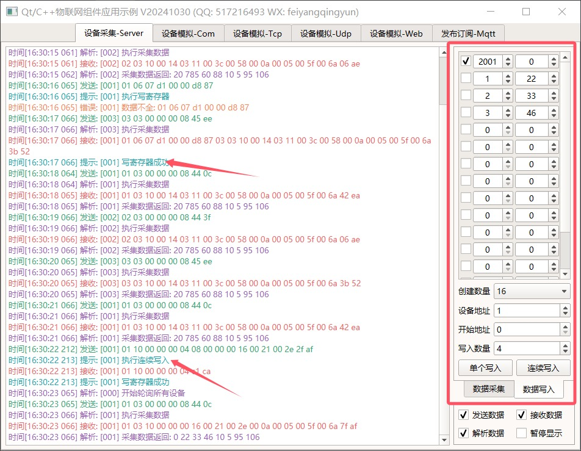
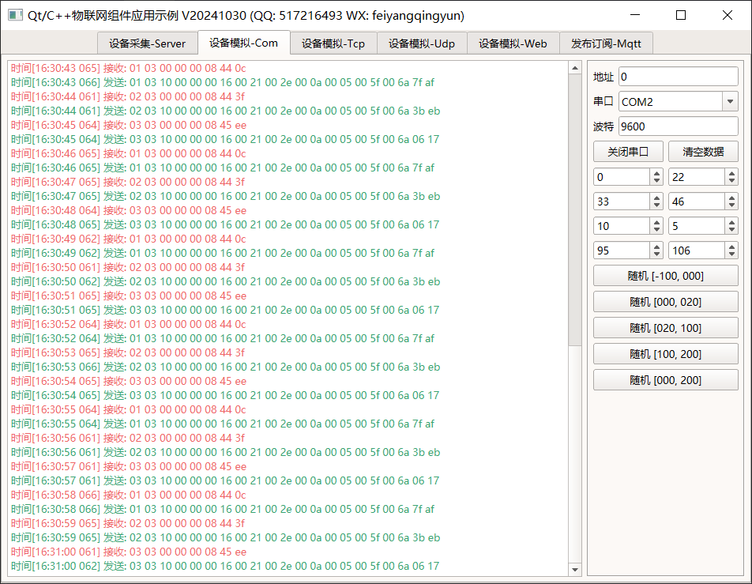
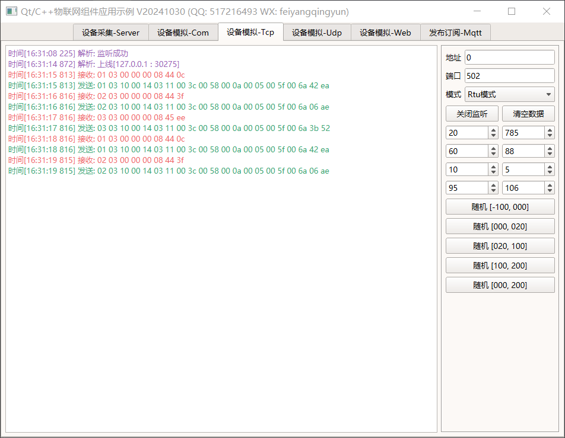
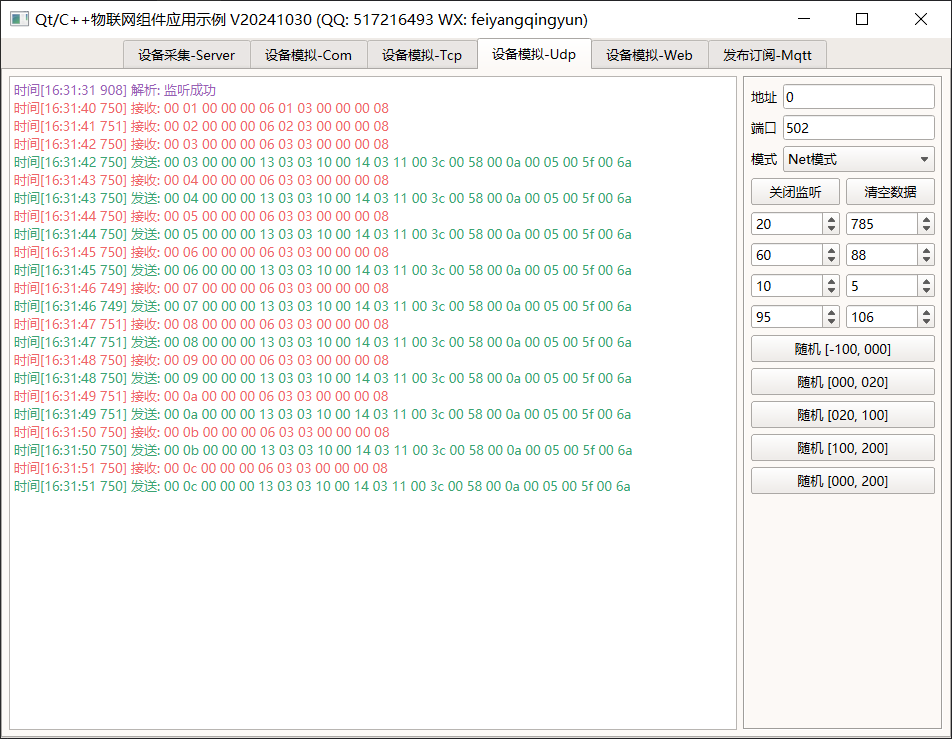
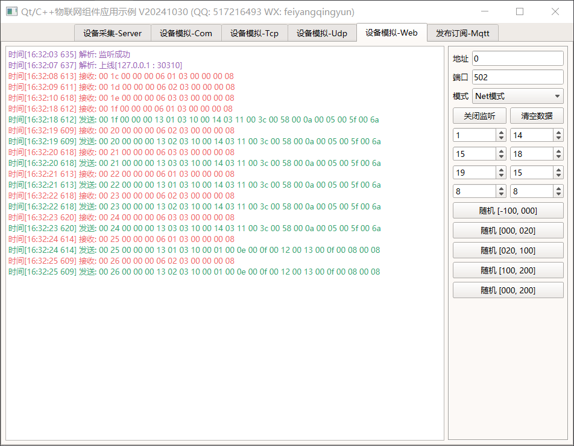
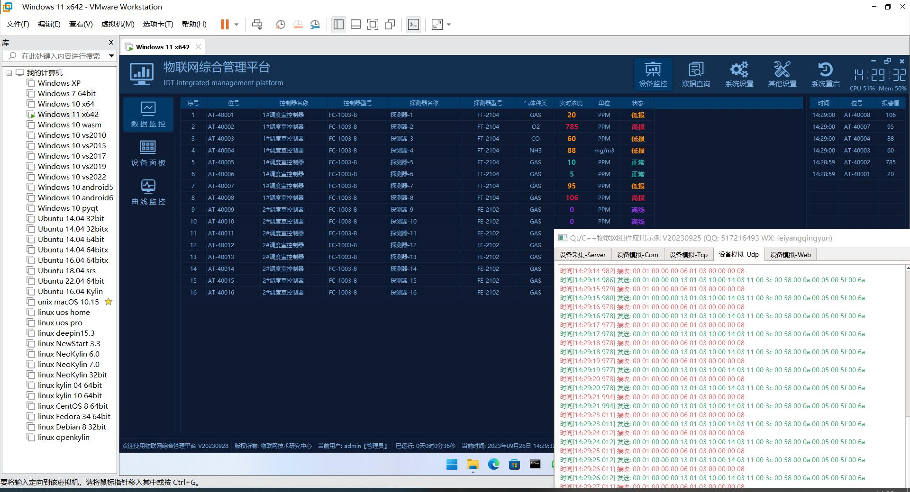

## 1、编译说明
1. 本组件封装的modbus采集支持任意Qt版本，mqtt采集最低要求Qt5.5，也就是要求存在websocket模块。
2. mqtt采集如果启用了ssl，比如mqtts://和wss://两种，还需要环境中有ssl的库，或者将ssl的库文件拷贝到可执行文件同一目录。
3. 如果编译提示 error:numeric_limits’ is not a class...，找到qglobal.h头文件，最上面加一行  #include <limits> 就行。

## 2、代码使用
### 2.0 基本步骤
1. 第一步，将core_iot目录拷贝到你的项目的上一级目录。
2. 第二步，打开项目的pro文件，引入物联网组件，include ($$PWD/../core_iot/core_iot.pri)。
3. 第三步，在代码文件引入对应头文件，#include "iothelper.h" #include "iotbase.h" #include "iotmodbusbase.h"，使用代码。

### 2.1 modbus
- 不同协议的端口通过传入不同的端口类型字符串区分。
- 串口采集需要设置串口号和波特率，网络采集需要设置主机地址和端口。
- 各种参数都有默认值，不设置就按照默认值处理。
- 协议类型中的Web是指websocket，也就是走websocket通信。
- 无论是串口采集还是网络采集，数据处理部分完全一致。采集到的数据都是按照统一的格式信号发出来。
- 数据顺序格式在下面的文档中使用说明部分有具体说明。

#### 2.1.1 串口采集
```cpp
//实例化串口采集类
IotBase *iotBase = IotHelper::newIotBase("Modbus_Rtu_Com");
//设置串口号和波特率
iotBase->setComName("COM1");
iotBase->setBaudRate(9600);
//指定采集的设备地址集合
QList<quint8> addrs;
addrs << 1 << 2 << 3;
//指定采集的寄存器起始地址
QList<int> indexs;
indexs << 0 << 0 << 0;
//指定采集的寄存器数量个数
QList<int> numbers;
numbers << 4 << 4 << 4;
//指定采集的数据顺序格式
QList<DataFormat> formats;
formats << Short_BA << Short_BA << Long_DCBA;
//设置采集的参数集合
iotBase->setInfo(addrs, indexs, numbers, formats);
//启动采集
iotBase->start();
```

#### 2.1.2 网络采集
```cpp
//实例化串口采集类
IotBase *iotBase = IotHelper::newIotBase("Modbus_Tcp");
//设置串口号和波特率
iotBase->setHostName("127.0.0.1");
iotBase->setHostPort(502);
//指定采集的设备地址集合
QList<quint8> addrs;
addrs << 1 << 2 << 3;
//指定采集的寄存器起始地址
QList<int> indexs;
indexs << 0 << 0 << 0;
//指定采集的寄存器数量个数
QList<int> numbers;
numbers << 4 << 4 << 4;
//指定采集的数据顺序格式
QList<DataFormat> formats;
formats << Short_BA << Short_BA << Long_DCBA;
//设置采集的参数集合
iotBase->setInfo(addrs, indexs, numbers, formats);
//启动采集
iotBase->start();
```

#### 2.1.3 线程运行
```cpp
//取消原来的启动
//iotBase->start();
//默认不是单独的线程运行/如果需要多线程运行/需要手动指定线程
QThread *iotThread = new QThread;
//关联信号槽/线程启动自动开始采集/线程结束自动销毁采集类
connect(iotThread, SIGNAL(started()), iotBase, SLOT(start()));
connect(iotThread, SIGNAL(finished()), iotBase, SLOT(deleteLater()));
//将采集类移动到线程执行
iotBase->moveToThread(iotThread);
//启动采集线程
iotThread->start();
```

#### 2.1.4 数据处理
```cpp
//关联采集数据信号
connect(iotBase, SIGNAL(receiveValue(QString, quint8, QList<float>)), this, SLOT(receiveValue(QString, quint8, QList<float>)));

//采集了几个寄存器/这里的数据就有几个
//为了兼容可能的数据格式/统一采用浮点数据作为参数的数据类型
void frmIotServer::receiveValue(const QString &portName, quint8 addr, const QList<float> &values)
{

}
```

### 2.2 mqtt

```cpp
//实例化mqtt采集类
IotMqttBase *mqttBase = new IotMqttBase(this);
//取出mqtt通信对象
QMqttClient *mqttClient = mqttBase->getMqttClient();
//关联收到数据信号
connect(mqttClient, SIGNAL(messageReceived(QByteArray, QMqttTopicName)), this, SLOT(messageReceived(QByteArray, QMqttTopicName)));
//设置通信参数/主机地址和端口参数必须设置
mqttClient->setHostname("broker.emqx.io");
mqttClient->setPort(1883);
//还有其他一堆参数根据情况按需设置
.....
//连接到服务器
mqttBase->connectToHost();
//从服务器断开
mqttBase->disconnectFromHost();

//发布主题
mqttClient->publish("qtmqtt/topic", "hello");
//订阅主题
mqttClient->subscribe("qtmqtt/topic");
```

## 3、使用说明
1. 设备模拟中如果设备地址填0则表示应答数据的地址取收到的地址，意味着永远不判断地址是否正确。
2. 设备采集会自动过滤掉离线的设备加快采集速度，并在60s间隔重新轮询一次所有设备，以便重新读取上线的设备，可以手动单击重新读取按钮用来立即执行采集所有设备。
3. **无论是modbus还是mqtt，都只是一个协议规范，根据该规范传输数据，至于对应数据位表示何种含义，比如是温度值还是湿度值，则由具体的厂家硬件决定，需要参考对应的厂家说明。**
4. 既然是个数据规范，那就无所谓是走串口还是网络或者websocket，理论上都可以，只是拿到数据后数据解析规则一样。
5. modbus slave模拟仿真工具使用说明 [https://zhuanlan.zhihu.com/p/529828725](https://zhuanlan.zhihu.com/p/529828725) 。

### 3.1 设备采集-Server
#### 3.1.0 数据格式
- 和其他的modbus采集工具一样，本组件也支持各种数据格式，其实就是高字节低字节的顺序。
- 一般是2字节表示一个数据，后面又有4字节表示一个数据，目前好像还有8字节表示一个数据的设备。
- 不同厂家的设备对应的字节顺序可能不同，要求可以自定义顺序，以便满足各种设备的接入。
- 4字节的数据可以是长整型，也可能是浮点数，按照标准规则计算出浮点值。面对浮点数的采集，很多国内的厂商的做法是以长整型数据发出，再除以一个值比如1000进行换算，因为下位机往往是单片机，单片机对浮点数运算很鸡肋很吃力。
- 最终的数据解析还要区分有符号和无符号，一般都是有符号，因为可以表示负数，比如温度就有负数。目前本组件都是按照有符号进行运算，后面有场景需要可以增加无符号的支持。
- 如果发现数据解析不对，可以调整对应的顺序试试。
- Short_AB，短整型数据，总共2字节，正序，高字节在前，低字节在后。
- Short_BA，短整型数据，总共2字节，反序，低字节在前，高字节在后。
- Long_ABCD，长整型数据，总共4字节，大端模式正序。
- Long_DCBA，长整型数据，总共4字节，小端模式正序。
- Long_BADC，长整型数据，总共4字节，大端模式反序。
- Long_CDAB，长整型数据，总共4字节，小端模式反序。
- Float_ABCD，浮点型数据，总共4字节，大端模式正序。
- Float_DCBA，浮点型数据，总共4字节，小端模式正序。
- Float_BADC，浮点型数据，总共4字节，大端模式反序。
- Float_CDAB，浮点型数据，总共4字节，小端模式反序。

#### 3.1.1 数据采集


1. 第一步，协议类型选择，本组件支持多种协议类型，如果选择的com，则需要填写串口号和波特率，选择的网络比如TCP，需要填写主机和端口号。
2. 第二步，选择轮询间隔，默认1s轮询一次。
3. 第三步，选择超时次数，默认3次，表示轮询3次还没有收到数据就离线。
4. 第四步，添加要采集的设备地址，起始地址和采集数量。默认会有三个地址，可以直接在表格中修改后再单击保存。
- 单击添加按钮，会生成一个默认值的新行，直接修改值，单击保存。
- 单击删除按钮，会将当前选中的行删除，删除后自动保存。
- 单击保存按钮，将表格中的所有数据保存到配置文件。
- 单击清空按钮，将表格中的所有数据清空，自动保存。
- 第一列填设备地址，1个字节，范围值1-247，切记这里是从1开始的。在RTU协议中对应在第一个字节，在TCP协议中对应在第六个字节。
- 第二列填寄存器开始地址，2个字节，范围值0-65535，切记这里是从0开始的，0表示第一个寄存器。
- 第三列填采集的数量，2个字节，和开始地址组合使用，开始地址+数量<=65535。
- 如果开始地址填0，采集数量填2，则表示采集寄存器1、寄存器2共2个寄存器的数据。
- 如果开始地址填7，采集数量填4，则表示采集寄存器8、寄存器9、寄存器10、寄存器11共4个寄存器的数据。
- 第四列填数据顺序格式，见上面数据格式说明。一般填Short_BA、Long_DCBA。
5. 单击启动服务按钮，会自动启动采集线程，如果采集设备存在则会显示对应采集到的数据。
6. 单击重新读取按钮，会立即复位设备离线状态，全部设备重新采集。为什么需要这个？因为一般在modbus采集过程中，都是按照轮询的方式采集的，但是实际场景中有些设备坏了或者根本没有，那每次都占用一次轮询时间是不是很浪费呢？这就需要自动跳过离线的设备，加快轮询速度。但是可能后面设备又接上去了，这个时候要么等待重连时间到了去采集，要么单击这个重新读取按钮立即触发。联调过程中往往喜欢单击这个按钮去立即触发一次，因为重连时间可能会比较大，傻傻的等待也不是个事。
7. 单击清空数据按钮，会清空左侧显示的数据，双击左侧的显示栏也会自动清空。
8. 所有收发的数据也会打印显示在左侧，方便查阅分析问题，也可以看到采集到的最终的值。

#### 3.1.2 数据写入


1. 第一步，生成寄存器复选框、寄存器地址框、寄存器数值框，数量下拉框选择要生成的数量，自动一键生成。复选框的作用是用于单个写入数据，勾选了则表示该寄存器需要写入数据。寄存器地址可以更改，默认按照0-64依次递增。
2. 第二步，填写好设备地址，从1开始，也就是对哪个设备写入数据。
3. 第三步，单击写入数据/单个写入按钮，对勾选的寄存器地址写入对应微调框的值。会依次发送勾选了所在行的值。
4. 第四步，如果需要连续写入，还需要设置开始地址和写入数量，再单击连续写入按钮。比如要连续写入数据 01 10 07 d4 00 02 04 00 00 03 e8 d9 8e ，设备地址填1，开始地址填2004（07 d4=2004），写入数量填2（00 02），上面寄存器面板中随便找个行，填寄存器地址2004（程序会自动找到要写入的起始寄存器地址所在行），右侧填数据0，下面这个寄存器数值填1000，00 00 03 e8 表示两个寄存器的数据，分别数寄存器2004=0,，2005=1000。由于是连续写入，所以只需要填第一个起始寄存器的地址即可，后面的只需要填数据。
5. 单个写入对应功能码0x06，连续写入对应功能码0x10。
6. 写入动作和写入成功在左侧都有打印显示，一般是深绿色颜色显示，关键字写寄存器。
7. 寄存器地址默认最大到64，可更改，比如要写入数据 01 06 07 D1 00 00 D8 87，则勾选一个复选框，然后在后面填地址2001（07 D1=寄存器地址2001），后面填数据0，单击单个写入按钮即可。
8. 所有的勾选状态和寄存器地址和数值，都会自动保存到配置文件，下次打开自动读取并应用。

### 3.2 设备模拟-Com


1. 第一步，填写要模拟的设备地址，0表示自动处理，也就是收到什么地址就应答什么地址。
2. 第二步，填写对应的串口号和波特率。
3. 第三步，单击打开串口，成功后会变成关闭串口字样。
4. 单击清空数据会将左侧打印栏的信息清空。
5. 右侧一堆微调框用于模拟对应设备多个寄存器地址的值，默认是8个寄存器，微调框可以输入负数值。
6. 单击随机按钮，用于随机生成该范围值的数据，方便测试验证数据。

### 3.3 设备模拟-Tcp


1. 第一步，填写要模拟的设备地址，0表示自动处理，也就是收到什么地址就应答什么地址。
2. 第二步，填写监听的端口号，这里没有指定网卡，默认绑定所有网卡。无论连接哪个网卡的端口都能连通。
3. 第三步，选择数据模式，可选Rtu模式和Net模式。
4. 第四步，单击开始监听，监听成功会变成关闭监听字样。
5. 单击清空数据会将左侧打印栏的信息清空。
6. 右侧一堆微调框用于模拟对应设备多个寄存器地址的值，默认是8个寄存器，微调框可以输入负数值。
7. 单击随机按钮，用于随机生成该范围值的数据，方便测试验证数据。

### 3.4 设备模拟-Udp


1. 第一步，填写要模拟的设备地址，0表示自动处理，也就是收到什么地址就应答什么地址。
2. 第二步，填写监听的端口号，这里没有指定网卡，默认绑定所有网卡。无论连接哪个网卡的端口都能连通。
3. 第三步，选择数据模式，可选Rtu模式和Net模式。
4. 第四步，单击开始监听，监听成功会变成关闭监听字样。
5. 单击清空数据会将左侧打印栏的信息清空。
6. 右侧一堆微调框用于模拟对应设备多个寄存器地址的值，默认是8个寄存器，微调框可以输入负数值。
7. 单击随机按钮，用于随机生成该范围值的数据，方便测试验证数据。

### 3.5 设备模拟-Web


1. 第一步，填写要模拟的设备地址，0表示自动处理，也就是收到什么地址就应答什么地址。
2. 第二步，填写监听的端口号，这里没有指定网卡，默认绑定所有网卡。无论连接哪个网卡的端口都能连通。
3. 第三步，选择数据模式，可选Rtu模式和Net模式。
4. 第四步，单击开始监听，监听成功会变成关闭监听字样。
5. 单击清空数据会将左侧打印栏的信息清空。
6. 右侧一堆微调框用于模拟对应设备多个寄存器地址的值，默认是8个寄存器，微调框可以输入负数值。
7. 单击随机按钮，用于随机生成该范围值的数据，方便测试验证数据。

### 3.6 发布订阅-Mqtt


1. 第一步，选择协议前缀，可选mqtt://、mqtts://、ws://、wss://四种，带s结尾的是走ssl通信，ws表示走websocket通信。一般选默认的mqtt://就好。
2. 第二步，填写服务所在主机地址，可以是IP地址也可以是网址，只要真实存在的就行。
3. 第三步，填写通信所用端口号，mqtt默认端口号是1883，以实际真实端口号为准。
4. 第四步，填写资源路径，这个要websocket通信才需要填写。
5. 第五步，选择协议版本，这个要和实际的一致，比如服务器不支持5.0，而这里选择的5.0则会失败。一般服务器都会支持所有协议，因为在通信过程中会告知当前用哪个协议。
6. 第六步，填写客户端唯一编号，这个可选，如果服务器要求一定要填写则填写，不然通信会失败。
7. 第七步，单击启动服务按钮，连接成功后会变成断开服务按钮。
8. 第八步，发布主题，先要在主题文本框中输入主题字符串，再单击发布主题按钮。
9. 第九步，订阅主题，先要在主题文本框中输入主题字符串，再单击订阅主题按钮。
10. 既可以发布主题，也可以订阅主题，还可以取消订阅的主题。
11. 有些场景只需要发布主题，比如下位机采集到的数据，则只需要发布主题带上数据内容即可。
12. 有些场景只需要订阅主题，比如上位机通过订阅主题获取到最新的数据，订阅对应主题后，有新的主题数据发布，就会立即更新通知订阅过的客户端。
13. 发布的主题和订阅的主题，标识可以相同也可以不同，同一个标识的才会触发通知机制，一旦发布主题就会触发通知订阅过该主题的客户端。
14. 切换到高级参数选项卡，有一堆高级参数可以设置，比如用户验证，这样可以防止非法用户访问。一般合法的用户信息需要在mqtt服务的后台设置，相当于权限控制。

## 4、功能特点
1. 支持多种物联网通信协议，包括modbus和mqtt。
2. 协议方式支持串口com通信、网络tcp通信、网络udp通信、网络websocket通信。
3. 数据规则支持rtu模式和网络模式，网络rtu模式也就是modbus rtu over tcp/udp/websocket。相当于modbus串口协议数据走网络方式通信。
4. 支持批量连续写入寄存器数值和单个写入寄存器数值。
5. 支持数据顺序格式的设置，比如大端小端，高字节在前低字节在前的设置。支持Short_AB、Short_BA、Long_ABCD、Long_CDAB、Long_BADC、Long_DCBA、Float_ABCD、Float_CDAB、Float_BADC、Float_DCBA等。
6. 支持数据位字节数设置，比如短整型、长整型、浮点型等。常规的一般是2字节表示一个数据位，也有设备是4字节表示一个数据位，还有4字节浮点数的形式。后期可能还有8字节一个数据位。
7. 支持mqtt协议，可设置主机地址和端口、协议版本、唯一标号、用户名称、用户密码。
8. 支持mqtt发布主题、订阅主题、取消订阅。
9. 定时自动发布主题，可设置保活时间、超时时间、过期时间。mqtt通信自动重连。
10. mqtt模拟数据收发支持多种格式，文本、json、base64、hex等。
11. mqtt同时支持websocket方式，还支持ssl方式通信。
12. 支持多种采集通讯方式，包括串口和网络等，可自由拓展其他方式。可同时采集多路。
13. 自定义采集间隔（精确到毫秒）和超时次数，超时后自动将离线的文件从轮询队列中移除，加快轮询速度。
14. 可设置最大超时重连间隔，将离线的设备重新探测一次，保证设备恢复正常后能够重新加入轮询队列。
15. 同时提供了设备模拟工具，支持各种协议，支持设定多个设备的数据值。
16. 模拟工具可随机切换模拟数据值，要正常随机数据就模拟生成正常范围的数据，要报警数据就模拟生成报警范围的数据。方便测试。
17. 多线程采集和解析数据，以信号的方式发送解析结果，不卡主线程。
18. 架构采用基类继承方式，通用处理在基类，极易拓展其他通信方式。
19. 接口友好，使用非常简单，设置要采集的地址集合、开始索引集合、采集数量集合、数据顺序格式四个参数即可。会自动组装对应协议的数据发送。
20. 采集后的数据以统一格式的信号发出来，非常简单易用。支持浮点型数据。
21. 采集指令有优先级，如果有自定义的数据需要优先执行。可以将优先级高的指令调用append方法插入即可。可批量采集也可单个采集。
22. 支持利用现有的通信链路发送自定义数据，这个数据可以不是标准的modbus协议，比如有时候需要一些私有协议数据，利用现有链路发送下去执行。
23. 多线程高并发，每个端口采集都是一个独立的线程，互不干扰，支持成千上万个设备采集。
24. 代码做了兼容，支持各种编译器，同时支持Qt4、Qt5、Qt6。
25. 跨平台，支持windows、linux、mac、嵌入式linux、android、各种国产系统和开发板等。

## 5、协议-modbus
### 5.0 模式说明
1. 总共有三种模式，RTU模式（一般用在串口），网络模式（一般用在网络），ASCII模式（一般用在串口，现在几乎很少用）。
2. RTU模式有校验字节，网络模式没有校验字节，因为网络通信数据不会出错。
3. 校验字节计算是从所有要发送的数据一起运算，从第一位的设备地址开始的，最后发送的完整数据是带上校验数据的。
4. 写单个寄存器的应答数据就是收到的数据，写多个寄存器的应答数据是包含起始地址和寄存器个数的数据体数据，并不是原数据，相当于告知从哪个起始地址开始写入了多少个寄存器数值成功。
5. 可以这么理解，网络模式的报文，包含了RTU的报文，是在RTU报文基础上，前面加上了事务标识符+协议标识符+长度字节共计6字节，同时末尾去掉了校验字节。网络报文=事务标识符+协议标识符+后面总共有多少个字节+RTU报文去掉校验字节。
6. 参考文章 https://blog.csdn.net/m0_47136030/article/details/139128639

### 5.1 RTU模式
#### 5.1.1 读多个寄存器-0x03
发送：01 03 00 00 00 04 44 09
- 01 设备地址。
- 03 功能码。
- 00 00 开始读取地址。
- 00 04 读取数据长度。
- 44 09 CRC校验

接收：01 03 08 00 0a 00 03 00 11 00 04 2a 11
- 01 设备地址。
- 03 功能码。
- 08 数据长度，表示后面有8字节的数据。
- 00 0a 第一个寄存器数据。
- 00 03 第二个寄存器数据。
- 00 11 第三个寄存器数据。
- 00 04 第四个寄存器数据。
- 2a 11 CRC校验

#### 5.1.2 写单个寄存器-0x06
发送：01 06 00 00 00 19 48 00
- 01 设备地址
- 06 功能码
- 00 00 寄存器地址
- 00 19 寄存器数值
- 48 00 CRC校验

接收：01 06 00 00 00 19 48 00 
说明：写入的什么数据就应答什么数据

#### 5.1.3 写多个寄存器-0x10
发送：01 10 00 00 00 04 08 00 19 00 58 00 37 00 2c af 65 
- 01 设备地址
- 10 功能码
- 00 00 寄存器开始地址
- 00 04 总共写入多少个寄存器
- 08 总共写入8个字节数据/永远是数量的两倍
- 00 19 写入的第1个寄存器数值
- 00 58 写入的第2个寄存器数值
- 00 37 写入的第3个寄存器数值
- 00 2c 写入的第4个寄存器数值
- af 65 CRC校验

接收：01 10 00 00 00 04 c1 ca
- 01 设备地址
- 10 功能码
- 00 00 寄存器开始地址
- 00 04 总共写入多少个寄存器

### 5.2 网络模式
#### 5.2.1 读多个寄存器-0x03
发送：00 01 00 00 00 06 01 03 00 00 00 04
- 00 01 事务标识符，一般是递增序号。
- 00 00 网络标识符，标识当前是modbus协议。
- 00 06 长度字节，表示后面有6个字节数据。
- 01 设备地址。
- 03 功能码。
- 00 00 开始读取地址。
- 00 04 读取数据长度。

接收：00 01 00 00 00 0b 01 03 08 00 0a 00 03 00 11 00 04
- 00 01 事务标识符，递增序号，和发送的一致。
- 00 00 网络标识符，标识当前是modbus协议。
- 00 0b 长度字节，表示后面有11个字节数据。
- 01 设备地址。
- 03 功能码。
- 08 数据长度，表示后面有8个字节的数据。
- 00 0a 第一个寄存器数据。
- 00 03 第二个寄存器数据。
- 00 11 第三个寄存器数据。
- 00 04 第四个寄存器数据。

#### 5.2.2 写单个寄存器-0x06
发送：00 01 00 00 00 06 01 06 00 00 00 4d 
- 00 01 事务标识符
- 00 00 网络标识符
- 00 06 长度字节
- 01 设备地址
- 06 功能码
- 00 00 写入寄存器地址
- 00 4d 写入寄存器数值

接收：00 01 00 00 00 06 01 06 00 00 00 4d
说明：写入的什么数据就应答什么数据

#### 5.2.3 写多个寄存器-0x10
发送：00 01 00 00 00 0f 01 10 00 00 00 04 08 00 0e 00 55 00 37 00 2c 
- 00 01 事务标识符
- 00 00 网络标识符
- 00 0f 长度字节
- 01 设备地址
- 10 功能码
- 00 00 寄存器开始地址
- 00 04 总共写入多少个寄存器
- 08 后面总共有多少个字节数据
- 00 0e 写入的第1个寄存器数值
- 00 55 写入的第2个寄存器数值
- 00 37 写入的第3个寄存器数值
- 00 2c 写入的第4个寄存器数值

接收：00 01 00 00 00 06 01 10 00 00 00 04
- 00 01 事务标识符
- 00 00 网络标识符
- 00 06 长度字节
- 01 设备地址
- 10 功能码
- 00 00 寄存器开始地址
- 00 04 总共写入多少个寄存器

## 6、协议-mqtt
- 参考：https://blog.csdn.net/sinat_41690014/article/details/130171072
- 编号：0123456789abcdefghijklm
- 用户：admin
- 密码：admin
- 主题：qtmqtt/topic
- 消息：hello Qt

### 6.1 版本3.1
连接：103300064d514973647003c2003c0017303132333435363738396162636465666768696a6b6c6d000561646d696e000561646d696e
应答：20 02 00 00

心跳：c0 00
应答：d0 00
断开：e0 00

发布：3016000c71746d7174742f746f70696368656c6c6f205174
应答：3016000c71746d7174742f746f70696368656c6c6f205174 (订阅后才有应答)

订阅：82110002000c71746d7174742f746f70696300
应答：9003000200

### 6.2 版本3.1.1
连接：103100044d51545404c2003c0017303132333435363738396162636465666768696a6b6c6d000561646d696e000561646d696e
应答：20 02 00 00

心跳：c0 00
应答：d0 00
断开：e0 00

发布：3016000c71746d7174742f746f70696368656c6c6f205174
应答：3016000c71746d7174742f746f70696368656c6c6f205174 (订阅后才有应答)

订阅：82110002000c71746d7174742f746f70696300
应答：9003000200

### 6.3 版本5.0
连接：103200044d51545405c2003c000017303132333435363738396162636465666768696a6b6c6d000561646d696e000561646d696e
应答：2013000010270010000025012a01290122ffff2801

心跳：c0 00
应答：d0 00
断开：e0 00

发布：3017000c71746d7174742f746f7069630068656c6c6f205174
应答：3017000c71746d7174742f746f7069630068656c6c6f205174 (订阅后才有应答)

订阅：8212000300000c71746d7174742f746f70696300
应答：900400030000

### 6.4 协议拆解


### 6.5 协议区别
- 3.1版本可变头部关键字是MQISdP，3.1.1和5.0是MQTT。


### 6.6 编译mqtt
- 参考链接 https://blog.csdn.net/luoyayun361/article/details/128339682
- 第一步：下载源码 git clone https://github.com/qt/qtmqtt
- 第二步：进入目录 cd qtmqtt
- 第三步：查看分支 git branch -a  看完后按 q 退出
- 第四步：切换版本 git checkout -b 5.10 origin/5.10
- 官方的qtmqtt组件最低支持5.10，代码稍微改改可以最低支持到5.3，因为5.3开始才有websocket模块。
- 客户端即可以是发布者，也可以是订阅者。
- 一般都是实现客户端，mqtt服务程序一般用第三方开源的。
- mqtt就是一套协议规范，建立在tcp长连接基础上，发布者和订阅者其实就是两个tcpsocket客户端，连接到tcpserver服务器，所有数据交互都由服务器处理，通过主题来区分消息类型。

## 7、效果图
### 7.1 windows


### 7.2 linux


### 7.3 wasm


- 物联网平台可以编译成wasm版本，直接网页运行，现在的浏览器基本的原生就支持wasm，并不是activex方式。
- 和wasm版本通信，选择websocket方式，这就是为什么modbus协议部分还要支持websocket的重要原因。

### 7.4 modbus slave


- 本组件支持和著名的模拟工具modbus slave/modbus poll组合使用。
- 支持slave中的各种通信模式比如串口和网络，RTU OVER xxx。
- 数据顺序可以自定义设置。