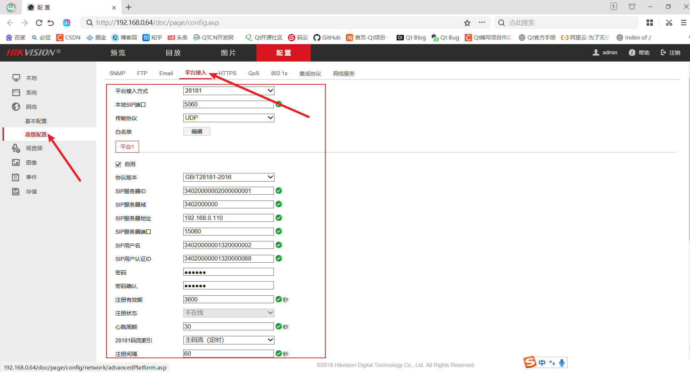
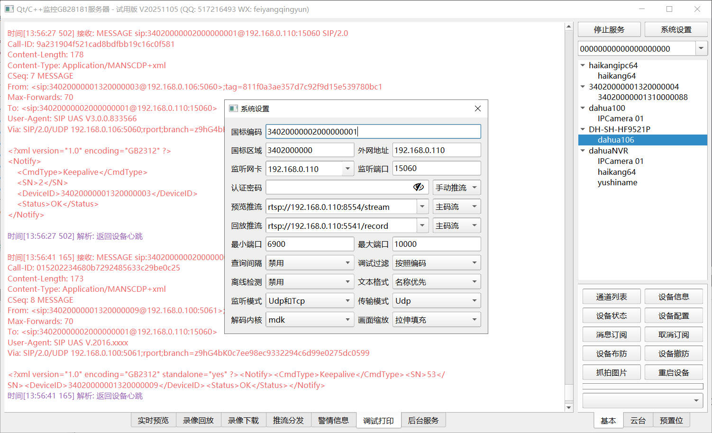
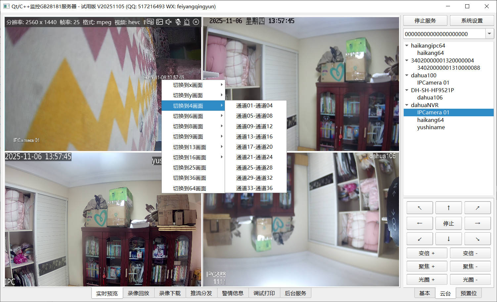
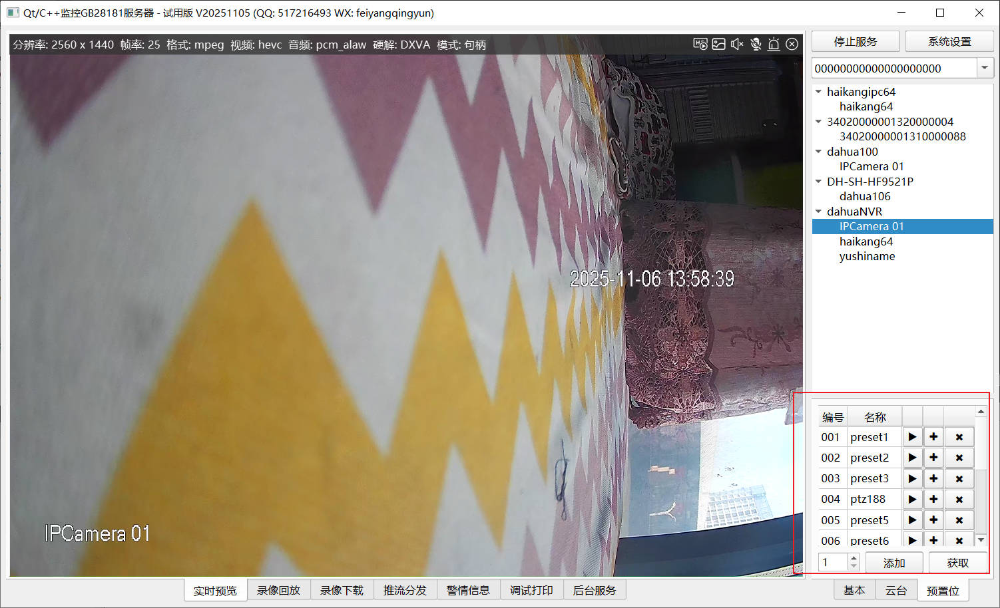
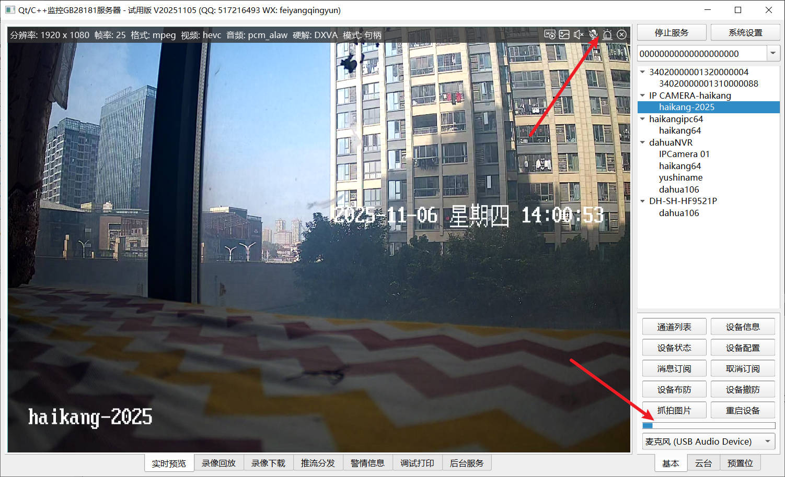
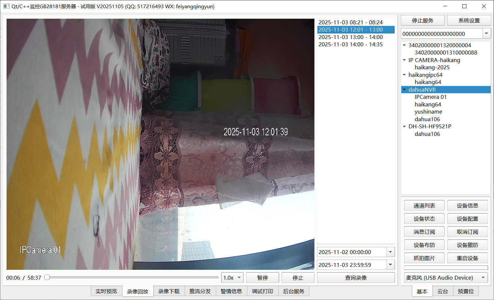
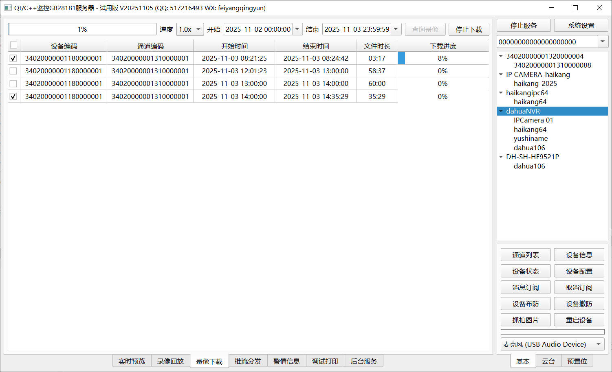
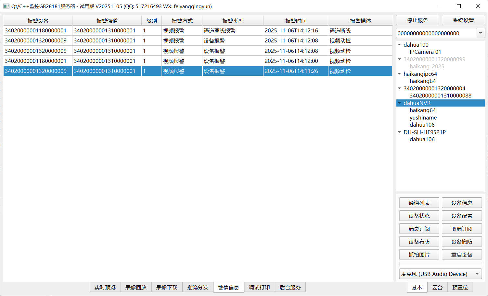
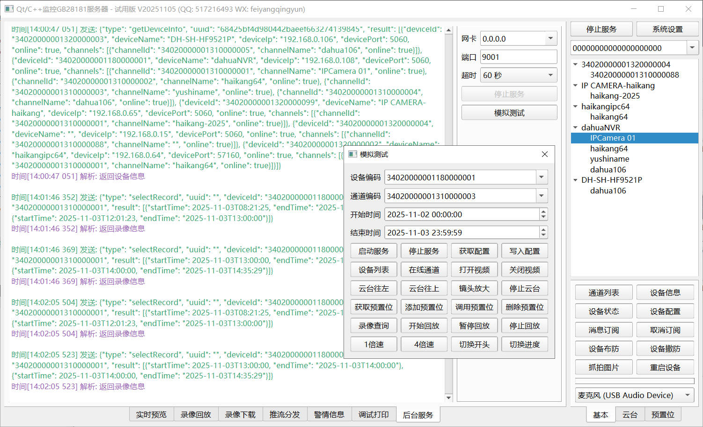

## 1 前言说明
1. 可执行文件在当前项目源码下的bin目录，编译后会自动生成。
2. **编译完成后记得将源码下的file目录下（切记是file目录下而不是file目录）的所有文件复制到可执行文件同一目录。**
3. 编译好之后记得将mdk的动态库文件dll_mdk_32/dll_mdk_64（如果是64位的Qt套件则选择dll_mdk_64）下面的所有文件复制到可执行文件同一目录。
4. 动态库下载: https://pan.baidu.com/s/13LDRu6mXC6gaADtrGprNVA 提取码: ujm7
5. 项目作品大全: [https://qtchina.blog.csdn.net/article/details/97565652](https://qtchina.blog.csdn.net/article/details/97565652)

## 2 代码使用
### 2.0 基本步骤
1. 第一步，将core_gb28181server和core_gb28181rtp以及core_gb28181widget目录拷贝到你的项目的上一级目录。
2. 第二步，打开项目的pro文件，引入gb28181组件，include ($$PWD/../core_gb28181server/core_gb28181server.pri) 和 include ($$PWD/../core_gb28181rtp/core_gb28181rtp.pri)以及include ($$PWD/../core_gb28181widget/core_gb28181widget.pri) 。
3. 第三步，在代码文件引入对应头文件，#include "gb28181server.h"，使用代码。
4. core_gb28181server负责信令解析和交互，core_gb28181rtp负责rtp解包，core_gb28181widget负责视频显示，解码默认使用core_videomdk组件，此组件使用ffmpeg开发。也可以切换成core_videoffmpeg组件。
5. 为了使用方便，特意封装了GB28181Widget类，专用于国标流的预览、回放、下载，不显示期间不会触发绘制，不用担心占用系统资源，此类也可用于推流。

### 2.1 启动服务
```cpp
//实例化国标服务类
GB28181Server *server = new GB28181Server;
//设置需要的参数
GB28181ServerPara para;
//国标编码
para.serverId = "34020000002000000001";
//区域编码
para.serverRealm = "3402000000";
//外网地址/设备端填写的服务器地址就是这个地址/如果是本地则和监听地址相同
para.serverHost = "192.168.0.110";
//监听地址
para.serverIp = "192.168.0.110";
//监听端口
para.serverPort = 15060;
//认证密码/为空的话则不启用认证
para.serverPwd = "12345678";
//查询通道信息的间隔/0表示不启用/单位秒
para.queryInterval = 0;
server->setServerPara(para);
//启动服务/udp和tcp同时监听
server->start(ListenMode_Both);

//绑定信号接收数据
//设备上下线
connect(server, SIGNAL(deviceChanged(QString, bool)), this, SLOT(deviceChanged(QString, bool)));
//通道变化
connect(server, SIGNAL(channelChanged(QString, QList<GB28181Channel>)), this, SLOT(channelChanged(QString, QList<GB28181Channel>)));
//警情上报
connect(server, SIGNAL(receiveEvent(GB28181Event)), this, SLOT(receiveEvent(GB28181Event)));
//媒体状态变化
connect(server, SIGNAL(receiveStatus(GB28181Status)), this, SLOT(receiveStatus(GB28181Status)));
//返回预置位信息
connect(server, SIGNAL(receivePreset(QList<GB28181Preset>)), this, SLOT(receivePreset(QList<GB28181Preset>)));   
//返回录像文件信息
connect(server, SIGNAL(receiveRecord(QList<GB28181Record>)), this, SLOT(receiveRecord(QList<GB28181Record>)));

//停止服务
server->stop();
```

### 2.2 获取信息
```cpp
//设备编码
QString deviceId = "34020000001320000001";
//通道编码
QString channelId = "34020000001310000001";
//获取通道信息
server->query(deviceId, "Catalog");
//获取设备信息
server->query(deviceId, "DeviceInfo");
//获取设备状态
server->query(deviceId, "DeviceStatus");
//查询设备配置
server->queryConfig(deviceId);
```

### 2.3 视频点播
```cpp
//点播必须针对某个设备某个通道
QString deviceId = "34020000001320000001";
QString channelId = "34020000001310000001";
//TransmitMode支持三种
//TransmitMode_UdpServer表示udp方式
//TransmitMode_TcpServer表示tcp被动方式
//TransmitMode_TcpClient表示tcp主动方式
//具体设备支持哪些模式由厂家决定/一般早期的设备都会支持udp模式/部分厂家只支持其中一种比如tcp被动模式
//返回值用来区分是哪个点播动作/一个设备的一个通道可以有多次点播
QString ssrc = server->invite(deviceId, channelId, 6900, "", "", 0, 0, TransmitMode);
//点播成功后会发出startVideo信号
//对于udp和tcp被动模式/建议先监听端口成功后再去点播
```

### 2.4 视频预览
```cpp
QString deviceId = "34020000001320000001";
QString channelId = "34020000001310000001";
ui->gb28181Widget->setPara(1, 0, TransmitMode_UdpServer, "192.168.0.110", "", PlayType_Preview);
ui->gb28181Widget->openVideo(deviceId, channelId);
```

### 2.5 录像查询
```cpp
QString deviceId = "34020000001320000001";
QString channelId = "34020000001310000001";
QString dateStart = "2025-04-18T00:00:00";
QString dateEnd = "2025-04-19T23:59:59";
server->queryRecord(deviceId, channelId, dateStart, dateEnd);

//查询成功后会通过receiveRecord信号发出来
void frmVideoPlayback::receiveRecord(const QList<GB28181Record> &records)
{
    foreach (GB28181Record record, records) {
        QString startTime = record.startTime;
        QString endTime = record.endTime;
        QString date = startTime.mid(0, 10);
        QString start = startTime.mid(11, 5);
        QString end = endTime.mid(11, 5);

        QListWidgetItem *item = new QListWidgetItem;
        item->setData(Qt::UserRole + 1, startTime);
        item->setData(Qt::UserRole + 2, endTime);
        item->setText(QString("%0 %1 - %2").arg(date).arg(start).arg(end));
        ui->listWidget->addItem(item);
    }
}
```

### 2.6 录像回放
```cpp
//为了简化操作/特意封装了gb28181Widget播放窗体类/只需要传入参数调用openvideo即可
QString deviceId = "34020000001320000001";
QString channelId = "34020000001310000001";
QString startTime = "2025-04-18T00:00:00";
QString endTime = "2025-04-18T00:05:00";
//设备需要的参数/播放速度/主码流子码流/传输模式/监听地址/推流地址
ui->gb28181Widget->setPara(1, 0, TransmitMode_UdpServer, "192.168.0.110", "", PlayType_Playback);
//设置开始时间和结束时间/查询录像文件返回的时候就有该文件对应的时间范围
ui->gb28181Widget->setTime(startTime, endTime);
//指定设备通道开始播放
ui->gb28181Widget->openVideo(deviceId, channelId);

//回放过程可以执行对应指令
//暂停播放
server->playControl(deviceId, channelId, PlayControl_Pause, 0, ssrc);
//继续播放
server->playControl(deviceId, channelId, PlayControl_Play, 0, ssrc);
//切换速度
server->playControl(deviceId, channelId, PlayControl_Scale, 8.0, ssrc);
//切换进度/进度值是当前文件开始的时间加上多少秒
server->playControl(deviceId, channelId, PlayControl_Position, 100);
```

### 2.7 录像下载
```cpp
//流程和回放完全一致/传过来的数据也是样一样/唯一区别就是解码后自行开启保存
QString deviceId = "34020000001320000001";
QString channelId = "34020000001310000001";
QString startTime = "2025-04-18T00:00:00";
QString endTime = "2025-04-18T00:05:00";
ui->gb28181Widget->setPara(8, 0, TransmitMode_UdpServer, "192.168.0.110", "", PlayType_Download);
ui->gb28181Widget->setTime(startTime, endTime);
ui->gb28181Widget->openVideo(deviceId, channelId);
```

### 2.8 警情订阅
```cpp
//警情订阅/测试下来发现设备没有订阅也会主动上报警情
QString deviceId = "34020000001320000001";
QString channelId = "34020000001310000001";
server->subscribe(deviceId, channelId);

//警情通过receiveEvent信号上报
void frmEvent::receiveEvent(GB28181Event event)
{
    ui->tableWidget->insertRow(0);
    ui->tableWidget->setItem(0, 0, new QTableWidgetItem(event.deviceId));
    ui->tableWidget->setItem(0, 1, new QTableWidgetItem(event.channelId));
    ui->tableWidget->setItem(0, 2, new QTableWidgetItem(QString::number(event.alarmPriority)));
    ui->tableWidget->setItem(0, 3, new QTableWidgetItem(GB28181Helper::getAlarmMethod(event.alarmMethod)));
    ui->tableWidget->setItem(0, 4, new QTableWidgetItem(GB28181Helper::getAlarmType(event.alarmInfo, event.alarmMethod, event.alarmType)));
    ui->tableWidget->setItem(0, 5, new QTableWidgetItem(event.alarmTime));
    ui->tableWidget->setItem(0, 6, new QTableWidgetItem(event.alarmDescription));
}
```

### 2.9 语音对讲
```cpp
//一般要求先打开视频后才能语音对讲/需要在视频中接收声音
QString deviceId = "34020000001320000001";
QString channelId = "34020000001310000001";
//开始语音对讲
ui->gb28181Widget->openAudio(deviceId, channelId);
//关闭语音对讲
ui->gb28181Widget->closeAudio(deviceId, channelId);
```

### 2.10 点播推流
```cpp
QString deviceId = "34020000001320000001";
QString channelId = "34020000001310000001";
QString pushUrl = "rtsp://192.168.0.110:8554/stream/34020000001320000001_34020000001310000001";
ui->gb28181Widget->setPara(1, 0, TransmitMode_UdpServer, "192.168.0.110", pushUrl, PlayType_Preview);
ui->gb28181Widget->openVideo(deviceId, channelId);
```

### 2.11 回放推流
```cpp
QString deviceId = "34020000001320000001";
QString channelId = "34020000001310000001";
QString pushUrl = "rtsp://192.168.0.110:8554/record/34020000001320000001_34020000001310000001";
QString startTime = "2025-04-18T00:00:00";
QString endTime = "2025-04-18T00:05:00";
//设备需要的参数/播放速度/主码流子码流/传输模式/监听地址/推流地址
ui->gb28181Widget->setPara(1, 0, TransmitMode_UdpServer, "192.168.0.110", pushUrl, PlayType_Playback);
//设置开始时间和结束时间/查询录像文件返回的时候就有该文件对应的时间范围
ui->gb28181Widget->setTime(startTime, endTime);
//指定设备通道开始播放
ui->gb28181Widget->openVideo(deviceId, channelId);
```

## 3 使用说明
### 3.0 设备设置
海康IPC后台设置界面：


海康NVR后台设置界面：


大华IPC后台设置界面：


大华NVR后台设置界面：


宇视NVR后台设置界面：


华为IPC后台设置界面：


### 3.1 系统设置


- 国标编码：对应设备端填的sip服务器编号，固定长度，具体编码规则按照国标文档约定来。
- 国标区域：对应设备端填的sip域。
- 外网地址：在云服务器上，对外提供公网访问的地址。在本地一般外网地址和监听网卡地址是相同的。
- 监听网卡：本地监听地址，可以从网卡下拉框选择不同的地址，如果选择0.0.0.0表示监听所有。
- 监听端口：本地监听的端口号，对应设备端填的sip服务器端口。
- 认证密码：默认为空表示不认证，也就是设备注册注销期间不做密码认证。对应设备端的注册密码。设置了密码后，还会对国标编码的正确性进行验证，比如设备传过来的注册指令带的国标编码不正确则会拒绝注册。
- 自动推流：下拉框可以选择手动推流还是自动推流，开启自动推流后，本程序相当于服务使用，一旦设备上线，自动点播并推流分发。手动的话需要双击对应通道后才会点播并推流。
- 预览推流：将预览的实时画面推流到流媒体服务程序，对外提供各种拉流地址包括但不限于rtsp/rtmp/http/wertc，可以在网页上拉流显示。建议和回放推流地址区分开来。对应拉流地址会在打印窗口打印出来。这里是可编辑下拉框，既可以下拉选择，也可以直接输入。
- 回放推流：将回放的实时画面推流到流媒体服务程序，对外提供各种拉流地址包括但不限于rtsp/rtmp/http/wertc，可以在网页上拉流显示。建议和预览推流地址区分开来。对应拉流地址会在打印窗口打印出来。这里是可编辑下拉框，既可以下拉选择，也可以直接输入。
- 码流类型：在预览推流和回放推流下拉框的后面，有个主码流子码流选项，这个表示对应点播拉流的时候采用何种码流，如果预览推流后面下拉框是子码流，则双击通道点播画面的时候，以子码流去拉流。
- 最小端口：收流用端口范围的最小端口号，建议大于1000，一般在云服务器上需要设置，上面一般按需开启的端口。
- 最大端口：收流用端口范围的最大端口号，不能小于最小端口号，一般在云服务器上需要设置，上面一般按需开启的端口。
- 查询间隔：默认禁用表示不会定期查询通道信息。
- 调试过滤：在软件的右上角有个地址编码下拉框，用来过滤调试打印信息的，也就是方便查看具体设备的收发数据，如果没有这个过滤，则所有收发数据都会显示，不方便查找具体哪个设备。按照编码表示下拉框是设备的国标编码，按照地址则下拉框是IP地址，有时候同一个IP会有多个设备，只不过通信端口不一样，所以此时建议选择按照编码来过滤。
- 监听模式：仅udp表示只监听udp通道，仅tcp表示只监听tcp通道，选择udp和tcp则两者都监听，默认两者都监听。
- 传输模式：对应拉流的时候数据的传输模式，可选udp、tcp被动、tcp主动三种模式。
- 解码内核：选用ffmpeg解码还是mdk解码，实时预览推荐mdk解码，录像回放推荐ffmpeg解码。
- 画面缩放：打开的视频画面按照等比例还是拉伸填充显示。
- 这些配置参数设置完都是立即应用的，国标服务器参数需要重新单击启动服务按钮应用，传输模式需要重新打开视频。

**拉流地址格式**
- 具体拉流格式是由流媒体服务程序决定的，下面用mediamtx举例。
- 预览推流地址：rtsp://127.0.0.1:8554/stream
- 回放推流地址：rtsp://127.0.0.1:8554/record
- 通用拉流地址：前缀/设备编码\_通道编码\_ssrc，为何有个ssrc？因为同一个通道可能打开了多个流。
- 预览拉流地址：rtsp格式  rtsp://127.0.0.1:8554/stream/34020000001320000001_34020000001310000001_0000010001
- 预览拉流地址：webrtc格式  http://127.0.0.1:8889/stream/34020000001320000001_34020000001310000001_0000010001
- 回放拉流地址：rtsp格式  rtsp://127.0.0.1:8554/record/34020000001320000001_34020000001310000001_0000010001
- 预览拉流地址：webrtc格式  http://127.0.0.1:8889/record/34020000001320000001_34020000001310000001_0000010001

### 3.2 实时预览




- 第一步：从设备列表选中某个设备，如果是需要打开实时预览，还需要选中某个通道，默认选择设备会自动以第一个通道作为默认通道。
- 单击通道列表可以获取该设备下的所有通道信息。相当于手动获取，如果系统设置那边查询间隔非禁用，则会按照选择的间隔自动查询。
- 单击设备信息、设备状态、设备配置按钮，可以查询选中设备的信息和状态以及配置参数。
- 单击打开视频，会以新视频窗体的方式弹出视频预览，该按钮对应代码也有直接点播请求的代码，可以自行在代码中切换，以便测试。关闭按钮同理。
- 选中设备列表的某个通道执行双击，自动在实时预览画面打开该通道的视频，切记有个传输模式，有些设备可能只支持udp，所以需要在系统设置界面传输模式下拉框选择udp，有些只支持tcp被动，具体由设备端本身决定。
- 鼠标移动到预览画面窗体，会自动出现悬浮条，显示对应的音视频流信息，有音视频格式帧率等信息，也可以在悬浮条上单击右上角的关闭按钮来停止点播。
- 在悬浮条上单击语音对讲按钮，自动开启语音对讲，同一时刻只允许一个通道处于对讲状态。
- 在实时预览窗体鼠标右键，会有画面分割的菜单，执行对应的菜单会切换到对应的画面。
- 在实时预览窗体，鼠标按下选中某个通道，在云台操作面板，单击上下左右等箭头按钮可以做云台操作，包括变倍、聚焦、光圈都可以进行操作。
- 在实时预览窗体，鼠标按下选中某个通道，在预置位操作面板，可以查询预置位、添加预置位、删除预置位、更新预置位、调用预置位等操作。

### 3.3 录像回放


- 第一步：设备列表选中某个设备和通道。
- 第二步：日期时间下拉框选择开始时间和结束时间，精确到秒。
- 第三步：单击查询录像按钮，右侧列表框会显示返回的录像文件的信息。
- 第四步：双击某个文件，自动回放该文件，左下角显示对应的当前进度和总时长。
- 第五步：单击进度条可以切换播放进度，倍速下拉框可以切换播放的速度，还可以暂停和继续播放。

### 3.4 录像下载


- 第一步：设备列表选中某个设备和通道。
- 第二步：日期时间下拉框选择开始时间和结束时间，精确到秒。
- 第三步：单击查询录像按钮，表格中显示收到的录像文件的详细信息，末尾显示下载进度。
- 第四步：在要下载的文件前面选中复选框，选中的才会执行下载。左上角有个全选复选框。
- 第五步：单击开始下载按钮，自动多线程下载文件，保存在可执行文件下的video目录。
- 默认8倍速下载，如果有些不支持倍速，则可以在速度下拉框选择1倍速。
- 每个下载都在右侧有个进度条显示当前下载进度，左上角是所有下载的总进度。
- 下载过程中可以单击停止下载来强制停止，会自动生成文件。
- **受限于设备端的发流速度，一般建议如果同时下载多个，用1倍速，多倍速的情况下建议一个个去下载，而不是同时批量下载。**

### 3.5 推流分发


- 这里不需要任何操作，只要有推流消息，就会显示在这里。
- 需要先在系统设置的预览推流或者回放推流下拉框中选择或者填入推流地址才会有推流。
- 推流类型一般有三种，预览推流表示双击对应通道显示后的推流，回放推流表示在录像回放中选择对应回放文件后的推流，还有个自动推流，对应配置文件有个参数autopush，默认false，可以改成true，这样只要有设备上线，就会自动点播拉流推流分发，一般用于开机后自动启动的场景，无需手动点播推流。
- 选中对应的行，会自动拷贝对应推流后的rtsp地址，可以打开vlc等播放器拉流验证下。
- 对应rtsp、rtmp等列，用来显示当前推出去的流，有多少个地方在拉取，flv的拉流可能会合并统计到rtmp类别中，hls的统计未必准确，这些数据都是实时从流媒体服务程序http获取到的。
- 无人观看列，用来显示所有推流的数据，无人观看多久，超过规定的时间还是无人观看，自动停止推流，从源头解决占用带宽浪费带宽问题。
- 推流地址这里简写的，只显示核心的设备编码和通道编码，前缀就是推流地址。

### 3.6 警情信息


- 这里不需要任何操作，只要有警情消息，就会显示在这里。
- 可以到设备的后台设置一些检测，比如入侵报警等，一旦触发，这里会显示对应警情详情。

### 3.7 后台服务


- 默认后台服务关闭的，需要在配置文件ServiceMode改成true。
- 这个服务用一套自定义的私有协议，和外部通信，可以通过tcp、http、mqtt等方式交互，比如获取设备列表、请求点播视频、回放视频、警情通知等，方便第三方根据协议进行交互接入使用。
- 单击模拟测试会弹出个框，写了简单的测试使用，用来验证每一条协议是否生效，也可以直接打开网络调试助手收发数据。
- 右侧是配置参数设置，网卡标识交互协议本地监听的网卡地址，下面是端口号，超时是指无人观看超时时间。后续还会增加其他参数。
- 在开启了后台服务后，双击通道可以预览，并不会推流，所有推流服务都是通过命令协议交互。

## 4 通信流程
### 4.0 代码流程
1. 第一步，准备数据头，根据不同的处理，组合不同的sip指令，其中固定有from、to、callid等字段。
2. 第二步，准备数据体，如果是获取设备信息、云台控制等，数据体是xml格式数据，如果是音视频点播、回放、下载等，是sdp格式数据，如果是播放控制比如倍速、暂停、切换进度等，是MANSRTSP格式数据。
3. 一般数据体中会带有通道编号。
4. 第三步，数据头和数据体组合成完整的数据，找到设备的地址和端口，发送数据。
5. 数据头和数据体之间必须有两个回车换行，否则无法解析。
6. 每个设备都至少有一个通道，整个层级关系只有2层，也就是设备和通道，如果是国标级联，也是将下面的设备重新定义成两层级编码再上传。

### 4.1 注册注销
1. 设备端发送REGISTER注册或者注销指令，注册对应Expires>0，注销对应Expires=0。
2. 服务端收到后，判断是否带了Authorization鉴权信息。
3. 没带则应答401 Unauthorized，设备端收到后发送带上Authorization鉴权信息的指令。
4. 带了则取出response字段内容，用服务端的密码，加密算法做哈希运算，得到正确的response，和设备端传过来的response对比，一致则表示密码正确。
5. 密码不正确应答400 Wrong password。
6. 密码正确则发出设备上线信号，并主动去订阅目录，拉取通道等信息。
7. 注册和注销处理流程完全一致，唯一区别就是通过判断Expires字段的值，=0表示注销。
8. 注销成功后，立即执行设备下线处理。

### 4.2 读取信息
1. 选中某个设备，读取信息都是针对单个设备，而不需要对通道。
2. 服务端主动发送MESSAGE指令，带上xml数据，其中xml数据中query节点中有个cmdtype用来指示何种操作类型。
3. cmdtype=Catalog表示目录订阅，也就是查询通道信息。
4. cmdtype=DeviceInfo表示读取设备信息，一般会取出其中的设备名称信息，作为设备的别名。
5. cmdtype=DeviceStatus表示读取设备状态，这个用的很少，意义不大。
6. cmdtype=ConfigDownload表示读取设备配置，一般会取出对应的超时时间和超时次数，用来判断设备下线。

### 4.3 设备控制
1. 选择某个设备某个通道，控制必须是对单个通道控制，而不是对某个设备。
2. 计算控制码，云台的各个方位以及聚焦和预置位等，都对应固定的字节，具体格式规范在gb28181-2016文档的第79页。
3. 将控制码放在DeviceControl指令的xml数据的PTZCmd节点，带上通道编码，组合xml数据，用sip指令下发给对应设备。
4. 设备端收到后会应答200 OK。
5. 读取预置位信息，会返回xml数据，一堆PresetList，逐个解析就行。
6. 标准中并没有看到如何修改预置位的名称，只有编号，统一preset1-preset255这种名称。而onvif协议中就可以在添加个修改的时候传入自定义的预置位名称，可以是中文。

### 4.4 视频点播
1. 选择某个设备某个通道，点播必须是对单个通道点播，而不是对某个设备。
2. 准备sdp数据，数据中包含了通道编码、服务器地址和端口，要点播的方式是udp、tcp主动、tcp被动。还可以拓展streamprofile字段表示主码流还是子码流等信息。
3. 发送INVITE的sip指令给设备端。
4. 设备应答带有sdp数据的200 OK指令，从中解析出来from、to、callid三个字段，这个用来唯一标识一个通信。
5. 服务端返回ack的sip指令，表示可以正常通信了。
6. 设备端将对应的音视频流数据用rtp打包发给对应的服务器端口。
7. 收到音视频数据，先要用rtp解包，解包后一般是ps流数据，再发给ffmpeg这种第三方库解码。
8. 关闭点播，服务端主动发送bye的sip指令到设备端，结束整个点播流程。

### 4.5 文件查询
1. 选择某个设备某个通道，查询录像文件必须是对单个通道，而不是对某个设备。
2. 选择开始时间和结束时间，通过MESSAGE指令，xml数据对应cmdtype=RecordInfo，发给设备端。
3. 设备应答会将录像文件信息打包成xml格式数据返回，一个xml数据中包含多个录像文件信息，可能会返回多个xml数据，一定要注意粘包处理。
4. 查询的时间范围建议小一点，一般一两天就好，不然返回的文件数量很多。
5. 返回的录像文件信息至少包含了设备编码、通道编码、开始时间、结束时间。后期录像回放和下载的时候要用到这几个参数。

### 4.6 录像回放
1. 回放流程和点播流程完全一致，唯一区别就是sdp中的t字段，如果是点播则对应t=0 0，如果是回放则填写的开始时间和回放时间，对应1970年经过的秒数。
2. 对应的s字段，点播是Play，回放是Playback，下载是Download。
3. 回放过程中可以进行播放控制，比如倍速，为何点播不能倍速？因为那个是实时流，不可能切换到未来的时间点。
4. 播放控制，先要准备数据体，也就是MANSRTSP格式数据，具体格式规范在gb28181-2016文档的第83页。
5. 播放控制通过发送INFO的sip指令给设备端。

### 4.7 语音对讲
1. 打开通道视频，在视频控件悬浮条上单击语音对讲按钮开始对讲，再次单击关闭对讲，同一时刻只允许一个通道处于对讲状态。
2. 先发送语音广播通知，通过MESSAGE指令，xml数据对应cmdtype=Broadcast，信息带上SourceID和TargetID。
3. 设备端收到语音广播通知后，会主动发起INVITE点播请求到服务端，请求中带了sdp信息。
4. 服务端解析sdp信息，应答点播请求，同样带上自己这边的sdp信息。
5. 服务端绑定端口，根据sdp内容选择是被动接收还是主动发起连接到设备端。
6. 设备端应答ack，开启语音对讲，服务端采集语音pcm数据，转成pcma，再通过rtp打包发给对应设备端口。
7. 默认设备支持的是局域网对讲，如果要公网对讲，需要支持tcp主动模式，也就是设备主动连接服务端，然后服务端对对应的连接发送语音数据。
8. 测试发现海康大华的设备，音频播放那边要设置成g711a，才能正常播放语音。查阅了下资料，好像如果要支持28181语音对讲，必须设置成这个，其他28181平台也是这个规范。
9. 海康的语音对讲默认是udp模式，如果要支持广域网对讲，也就是让设备端主动连接服务端，让后语音通信，必须要新版的设备才支持，后台28181设置的地方有个启用tcp广播，这个开关必须开启。
10. 大华的语音对讲如果要支持公网，必须采用非国标的sip交互，详情见 https://zhuanlan.zhihu.com/p/649434585 。

### 4.8 图像抓拍
1. 图像抓拍是gb28181-2022新增的功能，需要支持2022版本的设备才支持，主流厂家大概从2024年开始才可能支持这个版本。
2. 选择某个设备某个通道，图像抓拍必须是对单个通道，而不是对某个设备。
3. 发送图像抓拍通知，通过MESSAGE指令，xml数据对应cmdtype=DeviceConfig，信息带上SnapShotConfig节点，里面包含了SnapNum-抓拍张数、Interval-抓拍间隔、UploadURL-上传地址、SessionID-信息编号。
4. 服务端打开监听端口，等待设备端上传图片，通过http指令post过来，也可以选择ftp方式上传。
5. post请求数据中带了SessionID=9a7d3a146a1e420dbd00020ed01b39e7，filename="34020000001310000001022025081609220800000.jpg" 这两个关键数据。
6. 如果指定了抓拍多张，则每一张都会有一个post请求，对应SessionID相同，filename不同，收到图片后可以存储到本地，按照指定的文件名。
7. 全部抓拍上传完成，设备端发送MESSAGE指令，带xml数据，对应cmdtype=UploadSnapShotFinished，里面有SnapShotList节点指明上传了哪些图片，以便对照进行分类。

## 5 功能特点
1. 支持设备注册、注销、心跳、校时、注册认证、注销认证等。
2. 设备上线后可以手动获取设备状态、设备信息、配置信息、预置位信息等。
3. 设备上线后自动获取设备通道信息，包括中文通道名称。识别到通道上线离线变化，会重新获取该设备的所有通道信息。
4. 支持视频点播，可以分别点播主码流和子码流，内置rtp解包线程，解包后发给视频播放组件解码播放。
5. 每个设备每个通道支持点播多个视频，通过ssrc区分，支持共用端口和不同端口收流。
6. 支持对某个设备下面所有通道、某个通道、某个通道对应的某个流分别关闭。
7. 支持录像文件查询和回放，回放控制支持暂停播放、继续播放、倍速播放、切换播放进度。
8. 支持录像文件下载，支持倍速比如8倍速下载，可同时多线程批量下载。
9. 回放和下载同时支持IPC和NVR，比如摄像头自带的SD存储卡录像文件回放，NVR上的硬盘录像文件回放。
10. 支持云台控制，向上、向下、向左、向右、左上、右上、左下、右下方位移动，镜头放大缩小，光圈放大缩小，镜头聚焦放焦。
11. 支持预置位信息的查询、调用、添加、修改、删除等操作。
12. 自动目录订阅功能，通道上线下线都有对应的信号通知。
13. 内置定时读取通道信息机制，以保证通道信息是最新的，比如有些NVR是不断更新的通道信息。
14. 内置订阅警情和位置移动功能，订阅后各种警情事件比如运动目标检测报警、入侵检测报警、徘徊检测报警等自动上报。
15. 支持语音对讲功能，可以直接在视频窗体的悬浮条上单击语音对讲按钮，再次单击关闭对讲，对讲期间悬浮条常驻显示。
16. 支持设备布防撤防，布防后警情信息会主动上报。
17. 国标服务同时支持udp和tcp方式，可选只监听一种或者两种都监听，tcp方式自动处理粘包问题。
18. 国标拉流同时支持udp、tcp被动、tcp主动三种方式，每个通道都可以自由选择何种拉流方式。
19. 内置拉流端口池，每次拉流从中取出一个，关闭流自动回收端口号，重复利用。
20. 收流端口自动纠错，自动跳过被占用的端口，不会出现端口占用导致收流失败的情况。
21. 支持三种取流方式自动检测离线重连，检测到离线后，自动重启点播拉流整个流程。
22. 录像文件回放，上一个完成后自动切换到下一个继续回放，直到所有回放完成。支持高达8倍速回放。
23. 视频播放自适应硬解码，极低资源占用，实时性极好，带悬浮条显示视频流信息，可以直接在悬浮条单击按钮保存录像文件到本地。
24. 支持几千路国标消息交互并发，实时视频流支持64路同时显示，可以拓展更多路数。
25. 支持阿里云等云服务器，可以分别设置内网监听地址和外网访问地址，一般云服务器上是监听地址用内网，对外访问用外网地址。
26. 支持视频分发，也就是推流，视频通道打开后可以自动推流到流媒体服务器，其他需要的地方拉流即可，支持rtsp、rtmp、hls、webrtc等方式拉流。
27. 视频分发也叫推流分发，表格方式展示正在推流的信息，其中包括显示统计哪些流正在被多少个地址拉取，比如有两个地方通过rtsp打开了取流，则对应推流地址行所在rtsp列显示数量2，非常直观的展示有多少个拉流。
28. 视频分发支持无人观看超时自动关闭推流和点播，提高带宽的利用率，没人观看太久的时候，没必要点播拉流和推流。在后台服务模式下，通道推流自动复用，当该通道已经存在点播推流，则复用该路流数据，不会再去点播，节约资源。
29. 提供后台服务功能，定义了一套私有协议，根据私有协议进行交互，支持tcp、http、mqtt等方式交互，方便第三方程序接入集成。通信协议非常完整，支持获取设备列表、获取指定通道视频地址、云台控制、预置位操作、录像查询、录像回放、录像下载、回放倍速等控制、警情消息通知、视频点播和关闭等。
30. 支持注册重定向，方便做负载均衡和区域化部署，这样可以支持几十万个设备连接都没问题。
31. 支持图像抓拍，可以设置抓拍最多10张图片，可设置抓拍间隔，抓拍到的图片会通过信号通知。
32. 实时预览和录像回放都支持推流，推流支持叠加文字和图片水印以及各种ffmpeg支持的滤镜效果，支持多个水印同时叠加。
33. 同时支持gb28181-2011、gb28181-2016、gb28181-2022以及后续可能的所有协议版本。
34. SIP解析和交互采用纯Qt底层代码实现，udp/tcp通信交互，祖传原创代码解析，不依赖任何第三方。
35. 代码量少，gb28181交互部分共几千行代码，注释详细，接口友好，使用极其简单，提供非常详细的使用示例。
36. 支持海康、大华、宇视、华为、天地伟业等所有国标设备，包括一些没有ssrc的设备。
37. 支持所有Qt版本和编译器以及操作系统，包括但不限于win、linux、mac、android、嵌入式linux、树莓派香橙派、国产os等。

## 6 协议规范
### 6.0 协议解析
```cpp
//设备端发送
REGISTER sip:34020000002000000001@3402000000 SIP/2.0
Via: SIP/2.0/UDP 192.168.0.64:5060;rport;branch=z9hG4bK1945388331
From: <sip:34020000001320000002@3402000000>;tag=33226951
To: <sip:34020000001320000002@3402000000>
Call-ID: 1455222403
CSeq: 1 REGISTER
Contact: <sip:34020000001320000002@192.168.0.64:5060>
Max-Forwards: 70
User-Agent: IP Camera
Expires: 3600
Content-Length: 0

//服务端应答
SIP/2.0 200 OK
Via: SIP/2.0/UDP 192.168.0.64:5060;rport;branch=z9hG4bK1494593151
From: <sip:34020000001320000002@3402000000>;tag=33226951
To: <sip:34020000001320000002@3402000000>
Call-ID: 1455222403
CSeq: 2 REGISTER
User-Agent: wx_feiyangqingyun
Date: 2025-04-22T10:48:38.234
Content-Length: 0
```
#### 6.0.1 消息头
- 第1行表明这条SIP消息的方法（Method）是REGISTER。
- 34020000002000000001是SIP服务器的国标编码。
- 国标编码指的是由中心编码（8位） 、行业编码（2位） 、类型编码（3位）、序号（7位）四个码段共20位十进制数字字符构成。
- 具体国标编码方法可以参考GB/T 28181—2016中的附录D。
- 3402000000指的是SIP服务器的域国标ID。
- SIP/2.0指的是SIP协议版本。 

#### 6.0.2 Via头
- 第2行为Via头，Via头中包含了发送请求方的相关信息，后续需要使用这些信息进行回复。
- SIP/2.0/UDP表示使用的是2.0版本的SIP协议，使用的传输协议是UDP，也可以使用TCP协议，大部分设备默认是UDP协议，GB2016以前只支持UDP协议。
- 192.168.0.64:5060为请求发送方的IP地址和端口号。
- Via头中必须包含branch参数，具体值是一个在整个SIP通信过程中不重复的数值。
- branch是一个事务ID（Transaction ID），用于区分同一个UA所发起的不同Transaction，它不会对未来的request或者是response造成影响，对于遵循IETF RFC3261规范的实现，
- **这个branch参数的值必须用 z9hG4bK 字符串打头**。
-  其它部分是对To， From, Call-ID头域和Request-URI按一定的算法加密后得到，也可以是随机数或者UUID，目前没发现有什么用途。
-  rport字段表示使用rport机制路由响应，即发送的响应时，按照rport中的端口发送SIP响应。
-  也就是说IP和端口均完全遵照从哪里来的，发回哪里去的原则。
-  如果没有rport字段时，服务端的策略是IP使用UDP包中的地址，即从哪里来回哪里去，但是端口使用的是via中的端口，详情见IETF RFC35818。

#### 6.0.3 From头
- 第3行为From头，From头中包含了请求发送方的逻辑标识。
- 在GB28181协议中是发送请求的设备国标ID和域国标ID信息。
- tag参数是为了身份认证的，值为随机数字字符。 

#### 6.0.4 To头
- 第4行为To头，To头在SIP协议中是为了标明请求接收方的逻辑标识的。
- 在GB28181协议中填写的是发送请求的设备国标ID和域国标ID信息。

#### 6.0.5 Call-ID头
- 第5行为Call-ID头，Call-ID头是全局唯一的，在同一个session中保持一致，在不同session中不同。

#### 6.0.6 CSeq头
- 第6行为CSeq头，CSeq头又叫Command Seqence（命令队列），用于标识命令顺序。
- 值为序号+Method，序号部分为无符号整数，最大值为2^31。
- 序号起始值是随机的，后续在同一个session中依次递增。
- 比如发1 REGISTER没返回--->再发2 REGISTER--->没返回--->再发3 REGISTER--->这时返回了2 REGISTER就知道是第2个请求得到了响应。
- 对于ACK和CANCLE中的CSeq与INVITE中的Cseq保持一致。  

#### 6.0.7 其他头
- 第7行为Contact头，Contact头包含源的URI信息，用来给响应消息直接和源建立连接用。在GB28181协议中为SIP设备编码@源IP地址端口。
- 第8行为Max-Forwards头，Max-Forwards头用于设置包最大中转次数，默认是70。
- 第9行为User-Agent头，User-Agent头用于设置关于UA的信息，用户可以自定义。
- 第10行为Expires头，Expires头表示超时时间。 值=0表示注销。 
- 第11行为Content-Length头，Content-Length头表示消息体的长度，因为REGISTER消息不需要消息体，因此为0。如果携带了xml或者sdp等消息体，则>0。
- **在第一行比如REGISTER sip后面，以及from和to头，@符号后面部分的内容，海康是填充的域编号，而大华填充的是IP地址和端口，国标协议没有明确规定填啥。**

### 6.1 设备注册
```cpp
//注册请求：设备端-》服务端
REGISTER sip:34020000002000000001@3402000000 SIP/2.0
Via: SIP/2.0/UDP 192.168.0.64:5060;rport;branch=z9hG4bK1945388331
From: <sip:34020000001320000002@3402000000>;tag=33226951
To: <sip:34020000001320000002@3402000000>
Call-ID: 1455222403
CSeq: 1 REGISTER
Contact: <sip:34020000001320000002@192.168.0.64:5060>
Max-Forwards: 70
User-Agent: IP Camera
Expires: 3600
Content-Length: 0

//注册应答：服务端-》设备端
SIP/2.0 401 Unauthorized
Via: SIP/2.0/UDP 192.168.0.64:5060;rport;branch=z9hG4bK1945388331
From: <sip:34020000001320000002@3402000000>;tag=33226951
To: <sip:34020000001320000002@3402000000>
Call-ID: 1455222403
CSeq: 1 REGISTER
User-Agent: wx_feiyangqingyun
Date: 2025-04-22T10:48:38.014
Content-Length: 0
WWW-Authenticate: Digest realm="3402000000", algorithm=md5, nonce="9485904448344456af5449b51759016e"

//鉴权注册：设备端-》服务端
REGISTER sip:34020000002000000001@3402000000 SIP/2.0
Via: SIP/2.0/UDP 192.168.0.64:5060;rport;branch=z9hG4bK1494593151
From: <sip:34020000001320000002@3402000000>;tag=33226951
To: <sip:34020000001320000002@3402000000>
Call-ID: 1455222403
CSeq: 2 REGISTER
Contact: <sip:34020000001320000002@192.168.0.64:5060>
Authorization: Digest username="34020000001320000088", realm="3402000000", nonce="9485904448344456af5449b51759016e", uri="sip:34020000002000000001@3402000000", response="b1cfb3f036fbcf7d13b8ee3bbff89906", algorithm=MD5
Max-Forwards: 70
User-Agent: IP Camera
Expires: 3600
Content-Length: 0
    
//注册成功：服务端-》设备端
SIP/2.0 200 OK
Via: SIP/2.0/UDP 192.168.0.64:5060;rport;branch=z9hG4bK1494593151
From: <sip:34020000001320000002@3402000000>;tag=33226951
To: <sip:34020000001320000002@3402000000>
Call-ID: 1455222403
CSeq: 2 REGISTER
User-Agent: wx_feiyangqingyun
Date: 2025-04-22T10:48:38.234
Content-Length: 0

//注册重定向：服务端-》设备端
SIP/2.0 302 Moved Temporarily
Via: SIP/2.0/TCP 192.168.0.65:49983;rport;branch=z9hG4bK1260508101
From: <sip:34020000001320000099@3402000000>;tag=1486467600
To: <sip:34020000001320000099@3402000000>;tag=719011525
Call-ID: 719011525
CSeq: 2 REGISTER
User-Agent: wx_feiyangqingyun
Date: 2025-08-19T16:08:50.501
Content-Length: 0
Expires: 3600
//下面表示重定向到192.168.0.110服务器/端口15066
Contact: <sip:34020000002000000001@192.168.0.110:15066>
```

### 6.2 设备注销
```cpp
//注销请求：设备端-》服务端
REGISTER sip:34020000002000000001@3402000000 SIP/2.0
Via: SIP/2.0/UDP 192.168.0.64:5060;rport;branch=z9hG4bK473598701
From: <sip:34020000001320000002@3402000000>;tag=1501355611
To: <sip:34020000001320000002@3402000000>
Call-ID: 1128656905
CSeq: 3 REGISTER
Contact: <sip:34020000001320000002@192.168.0.64:5060>
Max-Forwards: 70
User-Agent: IP Camera
Expires: 0
Content-Length: 0

//注销应答：服务端-》设备端
SIP/2.0 401 Unauthorized
Via: SIP/2.0/UDP 192.168.0.64:5060;rport;branch=z9hG4bK473598701
From: <sip:34020000001320000002@3402000000>;tag=1501355611
To: <sip:34020000001320000002@3402000000>
Call-ID: 1128656905
CSeq: 3 REGISTER
User-Agent: wx_feiyangqingyun
Date: 2025-04-22T10:44:41.661
Content-Length: 0
WWW-Authenticate: Digest realm="3402000000", algorithm=md5, nonce="6ebe0922efda4939ba77fb41ef50e005"

//鉴权注销：设备端-》服务端
REGISTER sip:34020000002000000001@3402000000 SIP/2.0
Via: SIP/2.0/UDP 192.168.0.64:5060;rport;branch=z9hG4bK2110923860
From: <sip:34020000001320000002@3402000000>;tag=1501355611
To: <sip:34020000001320000002@3402000000>
Call-ID: 1128656905
CSeq: 4 REGISTER
Contact: <sip:34020000001320000002@192.168.0.64:5060>
Authorization: Digest username="34020000001320000088", realm="3402000000", nonce="6ebe0922efda4939ba77fb41ef50e005", uri="sip:34020000002000000001@3402000000", response="fed25d2e352370cc22bab577ac6e0d93", algorithm=MD5
Max-Forwards: 70
User-Agent: IP Camera
Expires: 0
Content-Length: 0

//注销成功：服务端-》设备端
SIP/2.0 200 OK
Via: SIP/2.0/UDP 192.168.0.64:5060;rport;branch=z9hG4bK2110923860
From: <sip:34020000001320000002@3402000000>;tag=1501355611
To: <sip:34020000001320000002@3402000000>
Call-ID: 1128656905
CSeq: 4 REGISTER
User-Agent: wx_feiyangqingyun
Date: 2025-04-22T10:44:41.768
Content-Length: 0
```

### 6.3 心跳保活
```cpp
//发送心跳：设备端-》服务端
MESSAGE sip:34020000002000000001@3402000000 SIP/2.0
Via: SIP/2.0/UDP 192.168.0.64:5060;rport;branch=z9hG4bK927308490
From: <sip:34020000001320000002@3402000000>;tag=287801969
To: <sip:34020000002000000001@3402000000>
Call-ID: 594186441
CSeq: 20 MESSAGE
Content-Type: Application/MANSCDP+xml
Max-Forwards: 70
User-Agent: IP Camera
Content-Length: 176

<?xml version="1.0" encoding="GB2312"?>
<Notify>
<CmdType>Keepalive</CmdType>
<SN>9</SN>
<DeviceID>34020000001320000002</DeviceID>
<Status>OK</Status>
<Info>
</Info>
</Notify>

//心跳应答：服务端-》设备端
SIP/2.0 200 OK
Via: SIP/2.0/UDP 192.168.0.64:5060;rport;branch=z9hG4bK2112299769
From: <sip:34020000001320000002@3402000000>;tag=1273238268
To: <sip:34020000002000000001@3402000000>
Call-ID: 2060526849
CSeq: 20 MESSAGE
User-Agent: wx_feiyangqingyun
Date: 2025-04-22T10:46:37.265
Content-Length: 0
```

### 6.4 信息查询
```cpp
//获取设备信息：服务端-》设备端
MESSAGE sip:34020000001320000002@192.168.0.64:5060 SIP/2.0
Via: SIP/2.0/UDP 192.168.0.110:15060;branch=z3hG9bK9225da1aa0084d469ebc6f6694bf6dc8
From: <sip:34020000002000000001@192.168.0.110:15060>;tag=1019
To: <sip:34020000001320000002@192.168.0.64:5060>
Call-ID: 35d87369b8b34488867dfbfbea2e91c2
CSeq: 20 MESSAGE
User-Agent: wx_feiyangqingyun
Max-Forwards: 70
Content-Length: 154
Content-Type: application/MANSCDP+xml
Contact: <sip:34020000002000000001@192.168.0.110:15060>

<?xml version="1.0" encoding="GB2312"?>
<Query>
  <CmdType>DeviceInfo</CmdType>
  <SN>10019</SN>
  <DeviceID>34020000001320000002</DeviceID>
</Query>

//设备信息返回：设备端-》服务端
MESSAGE sip:34020000002000000001@3402000000 SIP/2.0
Via: SIP/2.0/UDP 192.168.0.64:5060;rport;branch=z9hG4bK2061567590
From: <sip:34020000001320000002@3402000000>;tag=415404928
To: <sip:34020000002000000001@3402000000>
Call-ID: 541248116
CSeq: 20 MESSAGE
Content-Type: Application/MANSCDP+xml
Max-Forwards: 70
User-Agent: IP Camera
Content-Length: 324

<?xml version="1.0" encoding="GB2312"?>
<Response>
<CmdType>DeviceInfo</CmdType>
<SN>10019</SN>
<DeviceID>34020000001320000002</DeviceID>
<Result>OK</Result>
<DeviceName>IP CAMERA</DeviceName>
<Manufacturer>Hikvision</Manufacturer>
<Model>DS-2CD5024EFWD</Model>
<Firmware>V5.5.85</Firmware>
<Channel>1</Channel>
</Response>

//获取设备状态：服务端-》设备端
MESSAGE sip:34020000001320000002@192.168.0.64:5060 SIP/2.0
Via: SIP/2.0/UDP 192.168.0.110:15060;branch=z3hG9bK326223905abd4c258ab82e726ef93616
From: <sip:34020000002000000001@192.168.0.110:15060>;tag=1018
To: <sip:34020000001320000002@192.168.0.64:5060>
Call-ID: f69573838e564a4c8762a3465544037b
CSeq: 19 MESSAGE
User-Agent: wx_feiyangqingyun
Max-Forwards: 70
Content-Length: 156
Content-Type: application/MANSCDP+xml
Contact: <sip:34020000002000000001@192.168.0.110:15060>

<?xml version="1.0" encoding="GB2312"?>
<Query>
  <CmdType>DeviceStatus</CmdType>
  <SN>10018</SN>
  <DeviceID>34020000001320000002</DeviceID>
</Query>

//设备状态返回：设备端-》服务端
MESSAGE sip:34020000002000000001@3402000000 SIP/2.0
Via: SIP/2.0/UDP 192.168.0.64:5060;rport;branch=z9hG4bK1675009157
From: <sip:34020000001320000002@3402000000>;tag=2077654677
To: <sip:34020000002000000001@3402000000>
Call-ID: 1002341894
CSeq: 20 MESSAGE
Content-Type: Application/MANSCDP+xml
Max-Forwards: 70
User-Agent: IP Camera
Content-Length: 427

<?xml version="1.0" encoding="GB2312"?>
<Response>
<CmdType>DeviceStatus</CmdType>
<SN>10018</SN>
<DeviceID>34020000001320000002</DeviceID>
<Result>OK</Result>
<Online>ONLINE</Online>
<Status>OK</Status>
<DeviceTime>2025-04-22T11:14:23</DeviceTime>
<Alarmstatus Num="1">
<Item>
<DeviceID>34020000001340000001</DeviceID>
<DutyStatus>ONDUTY</DutyStatus>
</Item>
</Alarmstatus>
<Encode>ON</Encode>
<Record>ON</Record>
</Response>

//获取设备参数：服务端-》设备端
MESSAGE sip:34020000001320000002@192.168.0.64:5060 SIP/2.0
Via: SIP/2.0/UDP 192.168.0.110:15060;branch=z3hG9bK8fdd12678d10455faf6141abf099c783
From: <sip:34020000002000000001@192.168.0.110:15060>;tag=1020
To: <sip:34020000001320000002@192.168.0.64:5060>
Call-ID: 207ffb519158414a926275c01512ee0f
CSeq: 21 MESSAGE
User-Agent: wx_feiyangqingyun
Max-Forwards: 70
Content-Length: 197
Content-Type: application/MANSCDP+xml
Contact: <sip:34020000002000000001@192.168.0.110:15060>

<?xml version="1.0" encoding="GB2312"?>
<Query>
  <CmdType>ConfigDownload</CmdType>
  <SN>10020</SN>
  <DeviceID>34020000001320000002</DeviceID>
  <ConfigType>BasicParam</ConfigType>
</Query>

//设备参数返回：设备端-》服务端
MESSAGE sip:34020000002000000001@3402000000 SIP/2.0
Via: SIP/2.0/UDP 192.168.0.64:5060;rport;branch=z9hG4bK626480488
From: <sip:34020000001320000002@3402000000>;tag=1196765638
To: <sip:34020000002000000001@3402000000>
Call-ID: 1421185166
CSeq: 20 MESSAGE
Content-Type: Application/MANSCDP+xml
Max-Forwards: 70
User-Agent: IP Camera
Content-Length: 608

<?xml version="1.0" encoding="GB2312"?>
<Response>
<CmdType>ConfigDownload</CmdType>
<SN>10020</SN>
<DeviceID>34020000001320000002</DeviceID>
<Result>OK</Result>
<BasicParam>
<Name>IP CAMERA</Name>
<DeviceID>34020000001320000002</DeviceID>
<SIPServerID>34020000002000000001</SIPServerID>
<SIPServerIP>192.168.0.110</SIPServerIP>
<SIPServerPort>15060</SIPServerPort>
<DomainName>3402000000</DomainName>
<Expiration>3600</Expiration>
<Password>12345678</Password>
<HeartBeatInterval>30</HeartBeatInterval>
<HeartBeatCount>3</HeartBeatCount>
<PositionCapability>0</PositionCapability>
</BasicParam>
</Response>

//获取通道信息：服务端-》设备端
MESSAGE sip:34020000001320000002@192.168.0.64:5060 SIP/2.0
Via: SIP/2.0/UDP 192.168.0.110:15060;branch=z3hG9bKca6cdd79b54b4a898a08a027df9ee74f
From: <sip:34020000002000000001@192.168.0.110:15060>;tag=1021
To: <sip:34020000001320000002@192.168.0.64:5060>
Call-ID: 73a10bfd47944564aebc9f383d8d5dbc
CSeq: 22 MESSAGE
User-Agent: wx_feiyangqingyun
Max-Forwards: 70
Content-Length: 151
Content-Type: application/MANSCDP+xml
Contact: <sip:34020000002000000001@192.168.0.110:15060>

<?xml version="1.0" encoding="GB2312"?>
<Query>
  <CmdType>Catalog</CmdType>
  <SN>10021</SN>
  <DeviceID>34020000001320000002</DeviceID>
</Query>

//通道信息返回：设备端-》服务端
MESSAGE sip:34020000002000000001@3402000000 SIP/2.0
Via: SIP/2.0/UDP 192.168.0.64:5060;rport;branch=z9hG4bK759035473
From: <sip:34020000001320000002@3402000000>;tag=417631013
To: <sip:34020000002000000001@3402000000>
Call-ID: 438658409
CSeq: 20 MESSAGE
Content-Type: Application/MANSCDP+xml
Max-Forwards: 70
User-Agent: IP Camera
Content-Length: 963

<?xml version="1.0" encoding="GB2312"?>
<Response>
<CmdType>Catalog</CmdType>
<SN>10021</SN>
<DeviceID>34020000001320000002</DeviceID>
<SumNum>2</SumNum>
<DeviceList Num="2">
<Item>
<DeviceID>34020000001310000001</DeviceID>
<Name>hikangname</Name>
<Manufacturer>Hikvision</Manufacturer>
<Model>IP Camera</Model>
<Owner>Owner</Owner>
<CivilCode>3402000000</CivilCode>
<Address>Address</Address>
<Parental>0</Parental>
<ParentID>34020000002000000001</ParentID>
<SafetyWay>0</SafetyWay>
<RegisterWay>1</RegisterWay>
<Secrecy>0</Secrecy>
<Status>ON</Status>
</Item>
<Item>
<DeviceID>34020000001340000001</DeviceID>
<Name></Name>
<Manufacturer>Hikvision</Manufacturer>
<Model>AlarmIn</Model>
<Owner>Owner</Owner>
<CivilCode>3402000000</CivilCode>
<Address>Address</Address>
<Parental>0</Parental>
<ParentID>34020000001320000002</ParentID>
<SafetyWay>0</SafetyWay>
<RegisterWay>1</RegisterWay>
<Secrecy>0</Secrecy>
<Status>ON</Status>
</Item>
</DeviceList>
</Response>
```

### 6.5 云台控制
```cpp
//云台控制：服务端-》设备端
MESSAGE sip:34020000001320000002@192.168.0.64:5060 SIP/2.0
Via: SIP/2.0/UDP 192.168.0.110:15060;branch=z3hG9bK801c1bb8b2234e2e94be74f0087e28f5
From: <sip:34020000002000000001@192.168.0.110:15060>;tag=1022
To: <sip:34020000001320000002@192.168.0.64:5060>
Call-ID: 6822f48163704effb5b58d7031eba9f4
CSeq: 23 MESSAGE
User-Agent: wx_feiyangqingyun
Max-Forwards: 70
Content-Length: 251
Content-Type: application/MANSCDP+xml
Contact: <sip:34020000002000000001@192.168.0.110:15060>

<?xml version="1.0" encoding="GB2312"?>
<Control>
  <CmdType>DeviceControl</CmdType>
  <SN>10022</SN>
  <DeviceID>34020000001310000001</DeviceID>
  <PTZCmd>A50F01029600004D</PTZCmd>
  <Info><ControlPriority>5</ControlPriority></Info>
</Control>

//控制应答：设备端-》服务端
SIP/2.0 200 OK
Via: SIP/2.0/UDP 192.168.0.110:15060;branch=z3hG9bK801c1bb8b2234e2e94be74f0087e28f5
From: <sip:34020000002000000001@192.168.0.110:15060>;tag=1022
To: <sip:34020000001320000002@192.168.0.64:5060>;tag=1060605518
Call-ID: 6822f48163704effb5b58d7031eba9f4
CSeq: 23 MESSAGE
User-Agent: IP Camera
Content-Length: 0

//停止云台：服务端-》设备端
MESSAGE sip:34020000001320000002@192.168.0.64:5060 SIP/2.0
Via: SIP/2.0/UDP 192.168.0.110:15060;branch=z3hG9bK3cb5f960d94549888269c12f4ed29c9e
From: <sip:34020000002000000001@192.168.0.110:15060>;tag=1023
To: <sip:34020000001320000002@192.168.0.64:5060>
Call-ID: f3124084767d48909decda7579e3f96b
CSeq: 24 MESSAGE
User-Agent: wx_feiyangqingyun
Max-Forwards: 70
Content-Length: 251
Content-Type: application/MANSCDP+xml
Contact: <sip:34020000002000000001@192.168.0.110:15060>

<?xml version="1.0" encoding="GB2312"?>
<Control>
  <CmdType>DeviceControl</CmdType>
  <SN>10023</SN>
  <DeviceID>34020000001310000001</DeviceID>
  <PTZCmd>A50F0100000000B5</PTZCmd>
  <Info><ControlPriority>5</ControlPriority></Info>
</Control>

//停止应答：设备端-》服务端
SIP/2.0 200 OK
Via: SIP/2.0/UDP 192.168.0.110:15060;branch=z3hG9bK3cb5f960d94549888269c12f4ed29c9e
From: <sip:34020000002000000001@192.168.0.110:15060>;tag=1023
To: <sip:34020000001320000002@192.168.0.64:5060>;tag=1071996623
Call-ID: f3124084767d48909decda7579e3f96b
CSeq: 24 MESSAGE
User-Agent: IP Camera
Content-Length: 0
```

### 6.6 预置位置
```cpp
//查询预置位：服务端-》设备端
MESSAGE sip:34020000001320000002@192.168.0.64:5060 SIP/2.0
Via: SIP/2.0/UDP 192.168.0.110:15060;branch=z3hG9bK5f11d64dadd7466cb06011e8971b788d
From: <sip:34020000002000000001@192.168.0.110:15060>;tag=1024
To: <sip:34020000001320000002@192.168.0.64:5060>
Call-ID: aac3afc576894717a72ed58030479bcb
CSeq: 25 MESSAGE
User-Agent: wx_feiyangqingyun
Max-Forwards: 70
Content-Length: 155
Content-Type: application/MANSCDP+xml
Contact: <sip:34020000002000000001@192.168.0.110:15060>

<?xml version="1.0" encoding="GB2312"?>
<Query>
  <CmdType>PresetQuery</CmdType>
  <SN>10024</SN>
  <DeviceID>34020000001310000001</DeviceID>
</Query>

//返回预置位：设备端-》服务端
MESSAGE sip:34020000002000000001@3402000000 SIP/2.0
Via: SIP/2.0/UDP 192.168.0.64:5060;rport;branch=z9hG4bK1149716366
From: <sip:34020000001320000002@3402000000>;tag=2001348774
To: <sip:34020000002000000001@3402000000>
Call-ID: 360379917
CSeq: 20 MESSAGE
Content-Type: Application/MANSCDP+xml
Max-Forwards: 70
User-Agent: IP Camera
Content-Length: 258

<?xml version="1.0" encoding="GB2312"?>
<Response>
<CmdType>PresetQuery</CmdType>
<SN>10024</SN>
<DeviceID>34020000001310000001</DeviceID>
<PresetList Num="1">
<Item>
<PresetID>1</PresetID>
<PresetName>预置点 1</PresetName>
</Item>
</PresetList>
</Response>

//添加预置位：服务端-》设备端
MESSAGE sip:34020000001320000002@192.168.0.64:5060 SIP/2.0
Via: SIP/2.0/UDP 192.168.0.110:15060;branch=z3hG9bK76caaff468eb43ca9818e6fb38cfd057
From: <sip:34020000002000000001@192.168.0.110:15060>;tag=1025
To: <sip:34020000001320000002@192.168.0.64:5060>
Call-ID: a01a7be3ba6b4214ac0755d92d0096c5
CSeq: 26 MESSAGE
User-Agent: wx_feiyangqingyun
Max-Forwards: 70
Content-Length: 251
Content-Type: application/MANSCDP+xml
Contact: <sip:34020000002000000001@192.168.0.110:15060>

<?xml version="1.0" encoding="GB2312"?>
<Control>
  <CmdType>DeviceControl</CmdType>
  <SN>10025</SN>
  <DeviceID>34020000001310000001</DeviceID>
  <PTZCmd>A50F018100020038</PTZCmd>
  <Info><ControlPriority>5</ControlPriority></Info>
</Control>

//删除预置位：服务端-》设备端
MESSAGE sip:34020000001320000002@192.168.0.64:5060 SIP/2.0
Via: SIP/2.0/UDP 192.168.0.110:15060;branch=z3hG9bK9259fa44edce4797a69c4c58aa408d2c
From: <sip:34020000002000000001@192.168.0.110:15060>;tag=1027
To: <sip:34020000001320000002@192.168.0.64:5060>
Call-ID: 1bc5c4f7629b436ca66865c112ba2d47
CSeq: 28 MESSAGE
User-Agent: wx_feiyangqingyun
Max-Forwards: 70
Content-Length: 251
Content-Type: application/MANSCDP+xml
Contact: <sip:34020000002000000001@192.168.0.110:15060>

<?xml version="1.0" encoding="GB2312"?>
<Control>
  <CmdType>DeviceControl</CmdType>
  <SN>10027</SN>
  <DeviceID>34020000001310000001</DeviceID>
  <PTZCmd>A50F01830002003A</PTZCmd>
  <Info><ControlPriority>5</ControlPriority></Info>
</Control>

//修改预置位：服务端-》设备端
MESSAGE sip:34020000001320000002@192.168.0.64:5060 SIP/2.0
Via: SIP/2.0/UDP 192.168.0.110:15060;branch=z3hG9bKb968612c929f488bb3f105b907a61eba
From: <sip:34020000002000000001@192.168.0.110:15060>;tag=1031
To: <sip:34020000001320000002@192.168.0.64:5060>
Call-ID: 37bfa9cea6564707af579159d662db4a
CSeq: 32 MESSAGE
User-Agent: wx_feiyangqingyun
Max-Forwards: 70
Content-Length: 251
Content-Type: application/MANSCDP+xml
Contact: <sip:34020000002000000001@192.168.0.110:15060>

<?xml version="1.0" encoding="GB2312"?>
<Control>
  <CmdType>DeviceControl</CmdType>
  <SN>10031</SN>
  <DeviceID>34020000001310000001</DeviceID>
  <PTZCmd>A50F018100020038</PTZCmd>
  <Info><ControlPriority>5</ControlPriority></Info>
</Control>

//调用预置位：服务端-》设备端
MESSAGE sip:34020000001320000002@192.168.0.64:5060 SIP/2.0
Via: SIP/2.0/UDP 192.168.0.110:15060;branch=z3hG9bK3a2b16dffa134a25ad7158ef07ad8b07
From: <sip:34020000002000000001@192.168.0.110:15060>;tag=1032
To: <sip:34020000001320000002@192.168.0.64:5060>
Call-ID: 22431fe05dec47cbb789617b38caef58
CSeq: 33 MESSAGE
User-Agent: wx_feiyangqingyun
Max-Forwards: 70
Content-Length: 251
Content-Type: application/MANSCDP+xml
Contact: <sip:34020000002000000001@192.168.0.110:15060>

<?xml version="1.0" encoding="GB2312"?>
<Control>
  <CmdType>DeviceControl</CmdType>
  <SN>10032</SN>
  <DeviceID>34020000001310000001</DeviceID>
  <PTZCmd>A50F018200020039</PTZCmd>
  <Info><ControlPriority>5</ControlPriority></Info>
</Control>
```

### 6.7 警情订阅
```cpp
//警情订阅：服务端-》设备端
SUBSCRIBE sip:34020000001320000002@192.168.0.64:5060 SIP/2.0
Via: SIP/2.0/UDP 192.168.0.110:15060;branch=z3hG9bKb7c9f520b8104e56942cb6083322c99a
From: <sip:34020000002000000001@192.168.0.110:15060>;tag=1033
To: <sip:34020000001320000002@192.168.0.64:5060>
Call-ID: 715f605e3307409d8fb3a8617e04a0e5
CSeq: 34 SUBSCRIBE
User-Agent: wx_feiyangqingyun
Max-Forwards: 70
Content-Length: 407
Content-Type: application/MANSCDP+xml
Contact: <sip:34020000002000000001@192.168.0.110:15060>
Expires: 90
Event: presence

<?xml version="1.0" encoding="GB2312"?>
<Query>
  <CmdType>Alarm</CmdType>
  <SN>10033</SN>
  <DeviceID>34020000001310000001</DeviceID>
  <StartAlarmPriority>0</StartAlarmPriority>
  <EndAlarmPriority>0</EndAlarmPriority>
  <AlarmMethod>0</AlarmMethod>
  <AlarmType>all</AlarmType>
  <StartAlarmTime>2025-04-22T00:00:00</StartAlarmTime>
  <EndAlarmTime>2025-04-22T23:59:59</EndAlarmTime>
</Query>

//警情上报：设备端-》服务端
MESSAGE sip:34020000002000000001@3402000000 SIP/2.0
Via: SIP/2.0/UDP 192.168.0.64:5060;rport;branch=z9hG4bK797206218
From: <sip:34020000001320000002@3402000000>;tag=1532296992
To: <sip:34020000002000000001@3402000000>
Call-ID: 1650529689
CSeq: 20 MESSAGE
Content-Type: Application/MANSCDP+xml
Max-Forwards: 70
User-Agent: IP Camera
Content-Length: 283

<?xml version="1.0" encoding="GB2312"?>
<Notify>
<CmdType>Alarm</CmdType>
<SN>99</SN>
<DeviceID>34020000001310000001</DeviceID>
<AlarmPriority>4</AlarmPriority>
<AlarmMethod>5</AlarmMethod>
<AlarmTime>2025-04-22T11:26:02</AlarmTime>
<Info>
<AlarmType>2</AlarmType>
</Info>
</Notify>
```

### 6.8 视频点播
```cpp
//点播请求：服务端-》设备端
INVITE sip:34020000001310000001@192.168.0.64:5060 SIP/2.0
Via: SIP/2.0/UDP 192.168.0.110:15060;branch=z3hG9bK4de987b1737d494d9c63bb1464c9cdcb
From: <sip:34020000002000000001@192.168.0.110:15060>;tag=1034
To: <sip:34020000001310000001@192.168.0.64:5060>
Call-ID: 445efb2b5134487788334cd6acafe0a2
CSeq: 35 INVITE
User-Agent: wx_feiyangqingyun
Max-Forwards: 70
Content-Length: 323
Content-Type: application/sdp
Contact: <sip:34020000002000000001@192.168.0.110:15060>
Subject: 34020000001310000001:0000010000,34020000002000000001:0

v=0
o=34020000001310000001 0 0 IN IP4 192.168.0.110
s=Play
u=34020000001310000001:0
c=IN IP4 192.168.0.110
t=0 0
m=video 8888 TCP/RTP/AVP 96 97 98
a=recvonly
a=setup:active
a=connection:new
a=rtpmap:96 PS/90000
a=rtpmap:97 MPEG4/90000
a=rtpmap:98 H264/90000
a=downloadspeed:0
a=streamprofile:0
y=0000010000

//请求应答：设备端-》服务端
SIP/2.0 200 OK
Via: SIP/2.0/UDP 192.168.0.110:15060;branch=z3hG9bK4de987b1737d494d9c63bb1464c9cdcb
From: <sip:34020000002000000001@192.168.0.110:15060>;tag=1034
To: <sip:34020000001310000001@192.168.0.64:5060>;tag=1561889054
Call-ID: 445efb2b5134487788334cd6acafe0a2
CSeq: 35 INVITE
Contact: <sip:34020000001320000002@192.168.0.64:5060>
Content-Type: application/sdp
User-Agent: IP Camera
Content-Length: 206

v=0
o=34020000001320000002 2851 2851 IN IP4 192.168.0.64
s=Play
c=IN IP4 192.168.0.64
t=0 0
m=video 15060 TCP/RTP/AVP 96
a=setup:passive
a=sendonly
a=rtpmap:96 PS/90000
a=filesize:0
y=0000010000

//开始点播：服务端-》设备端
ACK sip:34020000001320000002@192.168.0.64:5060 SIP/2.0
Via: SIP/2.0/UDP 192.168.0.110:15060;branch=z3hG9bK4de987b1737d494d9c63bb1464c9cdcb
From: <sip:34020000002000000001@192.168.0.110:15060>;tag=1034
To: <sip:34020000001310000001@192.168.0.64:5060>;tag=1561889054
Call-ID: 445efb2b5134487788334cd6acafe0a2
CSeq: 35 ACK

//结束点播：服务端-》设备端
BYE sip:34020000002000000001@192.168.0.110:15060 SIP/2.0
Via: SIP/2.0/UDP 192.168.0.110:15060;branch=z3hG9bK7fe7407471734ba087eb4092db6ba108
From: <sip:34020000002000000001@192.168.0.110:15060>;tag=1019
To: <sip:34020000001310000001@192.168.0.100:5061>;tag=6d76ea76a4370853c9313f69995c7293
Call-ID: b5b5f90ba9b044868789d16fa3d0cc36
CSeq: 22 BYE
Contact: <sip:34020000002000000001@192.168.0.110:15060>
```

### 6.9 录像查询
```cpp
//查询文件：服务端-》设备端
MESSAGE sip:34020000001320000002@192.168.0.64:5060 SIP/2.0
Via: SIP/2.0/UDP 192.168.0.110:15060;branch=z3hG9bKe9591d42a3cc4518a421b62aa668428d
From: <sip:34020000002000000001@192.168.0.110:15060>;tag=1038
To: <sip:34020000001320000002@192.168.0.64:5060>
Call-ID: a6d47d255da543e79f484475b49340de
CSeq: 41 MESSAGE
User-Agent: wx_feiyangqingyun
Max-Forwards: 70
Content-Length: 262
Content-Type: application/MANSCDP+xml
Contact: <sip:34020000002000000001@192.168.0.110:15060>

<?xml version="1.0" encoding="GB2312"?>
<Query>
  <CmdType>RecordInfo</CmdType>
  <SN>10035</SN>
  <DeviceID>34020000001310000001</DeviceID>
  <StartTime>2025-04-18T00:00:00</StartTime>
  <EndTime>2025-04-19T23:59:59</EndTime>
  <Type>all</Type>
</Query>

//文件返回：设备端-》服务端
MESSAGE sip:34020000002000000001@3402000000 SIP/2.0
Via: SIP/2.0/UDP 192.168.0.64:5060;rport;branch=z9hG4bK727604973
From: <sip:34020000001320000002@3402000000>;tag=593479594
To: <sip:34020000002000000001@3402000000>
Call-ID: 40677081
CSeq: 20 MESSAGE
Content-Type: Application/MANSCDP+xml
Max-Forwards: 70
User-Agent: IP Camera
Content-Length: 3161

<?xml version="1.0" encoding="GB2312"?>
<Response>
<CmdType>RecordInfo</CmdType>
<SN>10035</SN>
<DeviceID>34020000001310000001</DeviceID>
<Name>hikangname</Name>
<SumNum>134</SumNum>
<RecordList Num="2">
<Item>
<DeviceID>34020000001310000001</DeviceID>
<Name>hikangname</Name>
<FilePath>file_path</FilePath>
<Address>Address 1</Address>
<StartTime>2025-04-18T10:23:02</StartTime>
<EndTime>2025-04-18T10:40:20</EndTime>
<Secrecy>0</Secrecy>
<Type>time</Type>
<FileSize>263094272</FileSize>
</Item>
<Item>
<DeviceID>34020000001310000001</DeviceID>
<Name>hikangname</Name>
<FilePath>file_path</FilePath>
<Address>Address 1</Address>
<StartTime>2025-04-18T10:40:20</StartTime>
<EndTime>2025-04-18T10:57:36</EndTime>
<Secrecy>0</Secrecy>
<Type>time</Type>
<FileSize>262488064</FileSize>
</Item>
</RecordList>
</Response>
```

### 6.10 录像回放
```cpp
//点播请求：服务端-》设备端
INVITE sip:34020000001310000001@192.168.0.64:5060 SIP/2.0
Via: SIP/2.0/UDP 192.168.0.110:15060;branch=z3hG9bK3d8b174429304a9d8af106f460debf9b
From: <sip:34020000002000000001@192.168.0.110:15060>;tag=1039
To: <sip:34020000001310000001@192.168.0.64:5060>
Call-ID: 2b3bf36cf7164ea0aac06fbd3e24680f
CSeq: 42 INVITE
User-Agent: wx_feiyangqingyun
Max-Forwards: 70
Content-Length: 342
Content-Type: application/sdp
Contact: <sip:34020000002000000001@192.168.0.110:15060>
Subject: 34020000001310000001:1000010003,34020000002000000001:0

v=0
o=34020000001310000001 0 0 IN IP4 192.168.0.110
s=Download
u=34020000001310000001:0
c=IN IP4 192.168.0.110
t=1744946094 1744947129
m=video 6902 RTP/AVP 96 97 98
a=recvonly
a=setup:passive
a=connection:new
a=rtpmap:96 PS/90000
a=rtpmap:97 MPEG4/90000
a=rtpmap:98 H264/90000
a=downloadspeed:8
a=streamprofile:1
y=1000010003

//请求应答：设备端-》服务端
SIP/2.0 200 OK
Via: SIP/2.0/UDP 192.168.0.110:15060;branch=z3hG9bK3d8b174429304a9d8af106f460debf9b
From: <sip:34020000002000000001@192.168.0.110:15060>;tag=1039
To: <sip:34020000001310000001@192.168.0.64:5060>;tag=723451991
Call-ID: 2b3bf36cf7164ea0aac06fbd3e24680f
CSeq: 42 INVITE
Contact: <sip:34020000001320000002@192.168.0.64:5060>
Content-Type: application/sdp
User-Agent: IP Camera
Content-Length: 211

v=0
o=34020000001320000002 539 539 IN IP4 192.168.0.64
s=Download
c=IN IP4 192.168.0.64
t=0 0
m=video 15060 RTP/AVP 96
a=setup:active
a=sendonly
a=rtpmap:96 PS/90000
a=filesize:262209536
y=1000010003

//开始点播：服务端-》设备端
ACK sip:34020000001320000002@192.168.0.64:5060 SIP/2.0
Via: SIP/2.0/UDP 192.168.0.110:15060;branch=z3hG9bK3d8b174429304a9d8af106f460debf9b
From: <sip:34020000002000000001@192.168.0.110:15060>;tag=1039
To: <sip:34020000001310000001@192.168.0.64:5060>;tag=723451991
Call-ID: 2b3bf36cf7164ea0aac06fbd3e24680f
CSeq: 42 ACK

//暂停播放：服务端-》设备端
INFO sip:34020000001310000001@192.168.0.64:5060 SIP/2.0
Via: SIP/2.0/UDP 192.168.0.110:15060;branch=z3hG9bK28e2fc9dac8b421f9a8450a10933210d
From: <sip:34020000002000000001@192.168.0.110:15060>;tag=1039
To: <sip:34020000001310000001@192.168.0.64:5060>;tag=723451991
Call-ID: 2b3bf36cf7164ea0aac06fbd3e24680f
CSeq: 43 INFO
User-Agent: wx_feiyangqingyun
Max-Forwards: 70
Content-Length: 41
Content-Type: application/MANSRTSP
Contact: <sip:34020000002000000001@192.168.0.110:15060>

PAUSE RTSP/1.0
CSeq: 1
PauseTime: now

//继续播放：服务端-》设备端
INFO sip:34020000001310000001@192.168.0.64:5060 SIP/2.0
Via: SIP/2.0/UDP 192.168.0.110:15060;branch=z3hG9bK86d002cd67004d0487ed0000b652c1bd
From: <sip:34020000002000000001@192.168.0.110:15060>;tag=1039
To: <sip:34020000001310000001@192.168.0.64:5060>;tag=723451991
Call-ID: 2b3bf36cf7164ea0aac06fbd3e24680f
CSeq: 45 INFO
User-Agent: wx_feiyangqingyun
Max-Forwards: 70
Content-Length: 41
Content-Type: application/MANSRTSP
Contact: <sip:34020000002000000001@192.168.0.110:15060>

PLAY RTSP/1.0
CSeq: 3
Range: npt=now-

//切换速度：服务端-》设备端
INFO sip:34020000001310000001@192.168.0.64:5060 SIP/2.0
Via: SIP/2.0/UDP 192.168.0.110:15060;branch=z3hG9bKd790bfabeea74caaba1594708fb91ada
From: <sip:34020000002000000001@192.168.0.110:15060>;tag=1039
To: <sip:34020000001310000001@192.168.0.64:5060>;tag=723451991
Call-ID: 2b3bf36cf7164ea0aac06fbd3e24680f
CSeq: 46 INFO
User-Agent: wx_feiyangqingyun
Max-Forwards: 70
Content-Length: 34
Content-Type: application/MANSRTSP
Contact: <sip:34020000002000000001@192.168.0.110:15060>

PLAY RTSP/1.0
CSeq: 4
Scale: 4

//切换进度：服务端-》设备端
INFO sip:34020000001310000001@192.168.0.64:5060 SIP/2.0
Via: SIP/2.0/UDP 192.168.0.110:15060;branch=z3hG9bKeb9b6621c9e446c9912f48127ecf0932
From: <sip:34020000002000000001@192.168.0.110:15060>;tag=1039
To: <sip:34020000001310000001@192.168.0.64:5060>;tag=723451991
Call-ID: 2b3bf36cf7164ea0aac06fbd3e24680f
CSeq: 47 INFO
User-Agent: wx_feiyangqingyun
Max-Forwards: 70
Content-Length: 41
Content-Type: application/MANSRTSP
Contact: <sip:34020000002000000001@192.168.0.110:15060>

PLAY RTSP/1.0
CSeq: 5
Range: npt=379-
```

### 6.11 文件下载
```cpp
//下载请求：服务端-》设备端
INVITE sip:34020000001310000001@192.168.0.64:5060 SIP/2.0
Via: SIP/2.0/UDP 192.168.0.110:15060;branch=z3hG9bK6a208da569eb44028e0d159f9f245386
From: <sip:34020000002000000001@192.168.0.110:15060>;tag=1041
To: <sip:34020000001310000001@192.168.0.64:5060>
Call-ID: 3bd33cd0f76c40e8b0d702b4212c74e5
CSeq: 50 INVITE
User-Agent: wx_feiyangqingyun
Max-Forwards: 70
Content-Length: 342
Content-Type: application/sdp
Contact: <sip:34020000002000000001@192.168.0.110:15060>
Subject: 34020000001310000001:1000010004,34020000002000000001:0

v=0
o=34020000001310000001 0 0 IN IP4 192.168.0.110
s=Download
u=34020000001310000001:0
c=IN IP4 192.168.0.110
t=1744856617 1744856620
m=video 6902 RTP/AVP 96 97 98
a=recvonly
a=setup:passive
a=connection:new
a=rtpmap:96 PS/90000
a=rtpmap:97 MPEG4/90000
a=rtpmap:98 H264/90000
a=downloadspeed:8
a=streamprofile:1
y=1000010004

//请求应答：设备端-》服务端
SIP/2.0 200 OK
Via: SIP/2.0/UDP 192.168.0.110:15060;branch=z3hG9bK6a208da569eb44028e0d159f9f245386
From: <sip:34020000002000000001@192.168.0.110:15060>;tag=1041
To: <sip:34020000001310000001@192.168.0.64:5060>;tag=1160726752
Call-ID: 3bd33cd0f76c40e8b0d702b4212c74e5
CSeq: 50 INVITE
Contact: <sip:34020000001320000002@192.168.0.64:5060>
Content-Type: application/sdp
User-Agent: IP Camera
Content-Length: 211

v=0
o=34020000001320000002 2589 2589 IN IP4 192.168.0.64
s=Download
c=IN IP4 192.168.0.64
t=0 0
m=video 15060 RTP/AVP 96
a=setup:active
a=sendonly
a=rtpmap:96 PS/90000
a=filesize:1367160
y=1000010004

//开始下载：服务端-》设备端
ACK sip:34020000001320000002@192.168.0.64:5060 SIP/2.0
Via: SIP/2.0/UDP 192.168.0.110:15060;branch=z3hG9bK6a208da569eb44028e0d159f9f245386
From: <sip:34020000002000000001@192.168.0.110:15060>;tag=1041
To: <sip:34020000001310000001@192.168.0.64:5060>;tag=1160726752
Call-ID: 3bd33cd0f76c40e8b0d702b4212c74e5
CSeq: 50 ACK
```

### 6.12 语音对讲
```cpp
//语音广播：服务端-》设备端
MESSAGE sip:34020000001320000001@192.168.0.100:5061 SIP/2.0
Via: SIP/2.0/UDP 192.168.0.110:15060;branch=z3hG9bK9085c93b7778426c805f0f000f31e2b6
From: <sip:34020000002000000001@192.168.0.110:15060>;tag=1017
To: <sip:34020000001320000001@192.168.0.100:5061>
Call-ID: 3a10b0f450f0499a95c61c3948522546
CSeq: 18 MESSAGE
User-Agent: wx_feiyangqingyun
Max-Forwards: 70
Content-Length: 200
Content-Type: application/MANSCDP+xml
Contact: <sip:34020000002000000001@192.168.0.110:15060>

<?xml version="1.0" encoding="GB2312"?>
<Notify>
  <CmdType>Broadcast</CmdType>
  <SN>10017</SN>
  <SourceID>34020000002000000001</SourceID>
  <TargetID>34020000001310000001</TargetID>
</Notify>

//广播应答：设备端-》服务端
MESSAGE sip:34020000002000000001@192.168.0.110:15060 SIP/2.0
Call-ID: e78acda839fea196d5a4867db0ffe585
Content-Length: 180
Content-Type: Application/MANSCDP+xml
CSeq: 8 MESSAGE
From: <sip:34020000001320000001@192.168.0.100:5061>;tag=49b96ab2783ae380cd1f39848c0cf0de
Max-Forwards: 70
To: <sip:34020000002000000001@192.168.0.110:15060>
User-Agent: SIP UAS V.2016.xxxx
Via: SIP/2.0/UDP 192.168.0.100:5061;rport;branch=z9hG4bK09c5c9872f1eaeeb2f753672bbcac574

<?xml version="1.0" encoding="GB2312" standalone="yes" ?><Response><CmdType>Broadcast</CmdType><SN>10017</SN><DeviceID>34020000001310000001</DeviceID><Result>OK</Result></Response>

//对讲请求：设备端-》服务端
INVITE sip:34020000002000000001@192.168.0.110:15060 SIP/2.0
Call-ID: fd514e34c2a7e40940437ac0272afd44
Contact: <sip:34020000001320000001@192.168.0.100:5061>
Content-Length: 240
Content-Type: application/sdp
CSeq: 1 INVITE
Expires: 120
From: <sip:34020000001320000001@192.168.0.100:5061>;tag=44088339578db934ef88a6a85534964b
Max-Forwards: 70
Subject: 34020000002000000001:03d7a8ef3276a8ef327,34020000001310000001:0552354c54f3354c54f
To: <sip:34020000002000000001@192.168.0.110:15060>
User-Agent: SIP UAS V.2016.xxxx
Via: SIP/2.0/UDP 192.168.0.100:5061;rport;branch=z9hG4bK57f191fc39457eb7ed729b95c4f8a7bf

v=0
o=34020000001320000001 0 0 IN IP4 192.168.0.100
s=Play
i=VCam BroadCast Session
c=IN IP4 192.168.0.100
t=0 0
m=audio 9776 RTP/AVP 8 96
a=recvonly
a=rtpmap:8 PCMA/8000/1
a=rtpmap:96 PS/90000
y=0022440333
f=v/0/0/0/0/0a/1/8/1

//请求应答：服务端-》设备端
SIP/2.0 200 OK
Via: SIP/2.0/UDP 192.168.0.100:5061;rport;branch=z9hG4bK57f191fc39457eb7ed729b95c4f8a7bf
From: <sip:34020000001320000001@192.168.0.100:5061>;tag=44088339578db934ef88a6a85534964b
To: <sip:34020000002000000001@192.168.0.110:15060>;tag=fd514e34c2a7e40940437ac0272afd44
Call-ID: fd514e34c2a7e40940437ac0272afd44
CSeq: 1 INVITE
User-Agent: wx_feiyangqingyun
Date: 2025-05-05T17:12:49.401
Content-Length: 166
Content-Type: application/sdp

v=0
o=34020000002000000001 0 0 IN IP4 192.168.0.110
s=Play
c=IN IP4 192.168.0.110
t=0 0
m=audio 15060 RTP/AVP 8
a=sendonly
a=rtpmap:8 PCMA/8000
y=0022440333

//开始对讲：设备端-》服务端
ACK sip:34020000002000000001@192.168.0.110:15060 SIP/2.0
Call-ID: 2136e2263aa41b1c846a318586303f8e
Contact: <sip:34020000001320000001@192.168.0.100:5061>
Content-Length: 0
CSeq: 1 ACK
From: <sip:34020000001320000001@192.168.0.100:5061>;tag=9cc9d4a2600e325f8fd545d2bd753e84
Max-Forwards: 70
To: <sip:34020000002000000001@192.168.0.110:15060>;tag=2136e2263aa41b1c846a318586303f8e
User-Agent: SIP UAS V.2016.xxxx
Via: SIP/2.0/UDP 192.168.0.100:5061;rport;branch=z9hG4bKd8aa8116cdee11c14a382f1fa6e5693e

//结束对讲：服务端-》设备端
BYE sip:34020000002000000001@192.168.0.110:15060 SIP/2.0
Via: SIP/2.0/UDP 192.168.0.110:15060;branch=z3hG9bKd2ed4e36330b418d80fa0873c72732f9
From: <sip:34020000002000000001@192.168.0.110:15060>;tag=fd514e34c2a7e40940437ac0272afd44
To: <sip:34020000001320000001@192.168.0.100:5061>;tag=44088339578db934ef88a6a85534964b
Call-ID: fd514e34c2a7e40940437ac0272afd44
CSeq: 19 BYE
Contact: <sip:34020000002000000001@192.168.0.110:15060>

//下面是tcp方式的/在对应的sdp文件的m=audio行有区别
//对讲请求：设备端-》服务端
NVITE sip:34020000002000000001@192.168.0.110:15060 SIP/2.0
Via: SIP/2.0/TCP 192.168.0.65:57527;rport;branch=z9hG4bK1273429191
From: <sip:34020000001320000099@192.168.0.65:5060>;tag=1812579261
To: <sip:34020000002000000001@192.168.0.110:15060>
Call-ID: 696755539
CSeq: 20 INVITE
Contact: <sip:34020000001320000099@192.168.0.65:57527;transport=TCP>
Content-Type: application/sdp
Max-Forwards: 70
User-Agent: IP Camera
Subject: 34020000002000000001:1,34020000001320000099:2
Content-Length:   250

v=0
o=34020000001320000099 601 601 IN IP4 192.168.0.65
s=Play
c=IN IP4 192.168.0.65
t=0 0
m=audio 15066 TCP/RTP/AVP 8 96
a=setup:active
a=connection:new
a=recvonly
a=rtpmap:8 PCMA/8000
a=rtpmap:96 PS/90000
y=0200000017
f=v/////a/1/8/1

//对讲应答：服务端-》设备端
SIP/2.0 200 OK
Via: SIP/2.0/TCP 192.168.0.65:57527;rport=57527;received=192.168.0.65;branch=z9hG4bK1273429191
From: <sip:34020000001320000099@192.168.0.65:5060>;tag=1812579261
To: <sip:34020000002000000001@192.168.0.110:15060>;tag=864237224
CSeq: 20 INVITE
Call-ID: 696755539
Contact: <sip:34020000002000000001@192.168.0.110:15060>
Content-Length: 226
Content-Type: APPLICATION/SDP

v=0
o=34020000002000000001 601 601 IN IP4 192.168.0.110
s=Play
c=IN IP4 192.168.0.110
t=0 0
m=audio 30004 TCP/RTP/AVP 8
a=sendonly
a=rtpmap:8 PCMA/8000
a=setup:passive
a=connection:new
y=0200000017
f=v/////a/1/8/1
```

### 6.13 图像抓拍
```cpp
//请求抓拍：服务端-》设备端
MESSAGE sip:34020000001320000001@192.168.0.65:5060 SIP/2.0
Via: SIP/2.0/UDP 192.168.0.110:15060;branch=z9hG4bKf19df7a91ae147e9a6097361dfb4878a
From: <sip:34020000002000000001@192.168.0.110:15060>;tag=1003
To: <sip:34020000001320000001@192.168.0.65:5060>
Call-ID: 90ba9bf6b96f429d879c9584c3795cca
CSeq: 4 MESSAGE
User-Agent: wx_feiyangqingyun
Max-Forwards: 70
Content-Length: 375
Content-Type: application/MANSCDP+xml
Contact: <sip:34020000002000000001@192.168.0.110:15060>

<?xml version="1.0" encoding="GB2312"?>
<Control>
  <CmdType>DeviceConfig</CmdType>
  <SN>10003</SN>
  <DeviceID>34020000001310000001</DeviceID>
  <SnapShotConfig>
    <SnapNum>1</SnapNum>
    <Interval>1</Interval>
    <UploadURL>http://192.168.0.110:9999/snap</UploadURL>
    <SessionID>3cffba1f5df14a47acb6594b2375c5c7</SessionID>
  </SnapShotConfig>
</Control>

//请求应答：设备端-》服务端
MESSAGE sip:34020000002000000001@3402000000 SIP/2.0
Via: SIP/2.0/UDP 192.168.0.65:5060;rport;branch=z9hG4bK113097658
From: <sip:34020000001320000001@3402000000>;tag=2122550998
To: <sip:34020000002000000001@3402000000>
Call-ID: 1066186907
CSeq: 20 MESSAGE
Content-Type: Application/MANSCDP+xml
Max-Forwards: 70
User-Agent: IP Camera
Content-Length:   173

<?xml version="1.0" encoding="GB18030"?>
<Response>
<CmdType>DeviceConfig</CmdType>
<SN>10003</SN>
<DeviceID>34020000001310000001</DeviceID>
<Result>OK</Result>
</Response>
        
//抓拍结束：设备端-》服务端
MESSAGE sip:34020000002000000001@3402000000 SIP/2.0
Via: SIP/2.0/UDP 192.168.0.65:5060;rport;branch=z9hG4bK1404287512
From: <sip:34020000001320000001@3402000000>;tag=1058173213
To: <sip:34020000002000000001@3402000000>
Call-ID: 21190318
CSeq: 20 MESSAGE
Content-Type: Application/MANSCDP+xml
Max-Forwards: 70
User-Agent: IP Camera
Content-Length:   321

<?xml version="1.0" encoding="GB18030"?>
<Notify>
<CmdType>UploadSnapShotFinished</CmdType>
<SN>10003</SN>
<DeviceID>34020000001310000001</DeviceID>
<SessionID>3cffba1f5df14a47acb6594b2375c5c7</SessionID>
<SnapShotList>
<SnapShotFileID>34020000001310000001022025081815045400000</SnapShotFileID>
</SnapShotList>
</Notify>
```

## 7 其他说明
### 7.1 地址说明
1. 在系统设置中，有两个填IP地址的地方，一个是外网地址，一个是网卡地址。
2. 网卡地址用到的地方有，28181服务监听，包括tcp和udp两种方式，还一个是抓图服务监听。
3. 外网地址用在很多地方，几乎所有的sip交互的指令，里面带的都是外网地址。
4. 理论上来说，在局域网内，网卡地址和外网地址都是相同的。

### 7.2 新增协议
**gb28181-2022主要新增了如下几个协议：**

1. 注册重定向，有些大的平台，下级域可能几万个设备同时连接，会导致并发不够，所以需要有个注册重定向机制，主动告知下级域重新注册到指定的上级域服务器，也就是相当于有个专门的重定向注册服务程序，专门分配注册连接。如果离线后，又需要先注册到重定向服务器，重新分配。
2. 图像抓拍，支持最多抓拍10张图片，可以设置抓拍间隔，最小1s。有些场景尤其是4G摄像头，为了省流量，平时就只需要抓拍报警图像到平台即可，平时不点播视频，视频太费流量。还有就是本来一些场景需要抓拍报警图片专门存储，之前2016版本只能去点播视频抓图，整个过程很繁琐很慢，使用非常鸡肋，而且费宽带。
3. 云台绝对控制，也叫精准控制，之前云台只能连续控制，也是最常用的方式，有些场景需要精准定位控制云台。并且云台位置变化会主动推送到服务器。
4. 增加了看守位的查询HomePositionQuery、巡航轨迹列表查询CruiseTrackListQuery、巡航轨迹查询CruiseTrackQuery、目标跟踪控制命令TargetTrack。
5. 增加了存储卡状态查询及应答命令，设备升级命令。这两个用的少一些。

### 7.3 个人理解
1. gb2818协议是基于sip协议的一套协议框架，而sip是和http协议类似的一套基于udp/tcp载体的协议，最终底层通过udp/tcp收发数据。sip是一套多媒体通信框架，而gb28181就是在这套框架上，定义了具体的通信内容，也就是收发数据填充的内容。
2. sip协议收发通常用的第三方开源库有osip/exosip，exosip依赖osip，是对osip的二次封装，带了具体传输层，osip相当于用来构建要收发的数据，本身没有收发功能。还有个更强大开源库pjsip，带了rtp解析。具体可参考 https://blog.csdn.net/weixin_43147845/article/details/144219082
3. sip协议说复杂也复杂，说简单也简单，复杂就是涉及到的具体协议规约特别庞大，和http协议是并列的一种机制。简单就是如果只是少量的通信，可以直接用udp/tcp通信收发解析，要发送的数据每一行都回车换行，最后一起发出去即可。就是发送和解析不大方便，需要去寻找和取出关键字再处理，而开源库会给你处理好对应的数据结构，比如解析后有枚举字段直接判断。
4. onvif是国际标准协议，gb28181是国家标准协议，各有优缺点，onvif通常是通过搜索到设备再去和设备通信，而gb28181刚好相反，是让设备主动连服务器，带上校验等参数，连上后，服务器再去和设备通信。这样相当于可以跨网了，而onvif通常只能局域网。gb28181还有个优势就是组网，可以层层级联，非常适合国内各种大监控系统的建设。
5. onvif客户端是先udp组播获取到设备，然后再发送http请求到不同的地址来交互，请求中可以获取到视频流rtsp地址，然后自己用ffmpeg等框架打开这个地址播放就行。而gb28181服务端是先udp/tcp监听端口，对连上的设备进行sip协议格式的数据内容的交互，发送请求播放指令后，开启发送rtp数据包，再用ffmpeg等框架解析这个数据包就行。
6. gb28181注册的时候Expires为有效期时间，一般是3600秒，如果是0则表示注销。同理订阅也是这个机制，订阅下发的时候有个有效期，如果有效期0就表示取消订阅。

### 7.4 要点总结
1. gb28181协议一般会选择udp通信，默认也是udp，早期国标设备都是只支持udp。
2. 服务端开启端口监听，设备端填写好对应参数后，会尝试往对应端口发数据进行连接。
3. 设备端间隔（心跳间隔默认是60s）发送REGISTER信令，服务端收到后，分析数据中是否带了鉴权信息（也就是用户认证相关信息），没有带的话则应答Unauthorized，带了的话，可以取出认证的信息，和要求的参数对比，比如国标服务端编号、认证密码、域编码信息，不一致则应答信息错误，叫客户端重新发。都没问题则表示认证通过。
4. 认证后服务端发送MESSAGE信令，带上xml数据，获取设备信息，收到设备信息后，再去查阅目录也就是获取通道列表。
5. 设备端在注册成功后，每隔一段时间发送一次心跳信息。方便服务端判断是否离线。
6. 设备端一旦注册成功，在有效期（一般是3600s）内，不会再去注册，默认就是认为已经注册成功。所以有时候服务端这边开启服务后，未必先收到REGISTER注册指令，而是可能先收到的心跳指令，所以服务端这边要做个特殊处理，收到心跳后，先判断该设备在系统中是否已经存在，不存在则先获取设备信息，再去获取通信列表。
7. 服务端支持多个设备注册，通过设备编号区分，严格要求同一个系统中设备编号不能重复，否则容易错乱。
8. 每个设备都可以有多个视频通道，一般摄像头IPC只有1个通道，录像机NVR有多个通道。如果是国标级联，相当于把服务端当做一台NVR设备，每个设备的通道都转换成唯一标识的通道。
9. 点播视频和云台控制等，都有个前提是要先获取到对应的通道列表，因为下发的数据中就要指定是哪个通道。
10. 点播视频是服务端向设备端通过发送INVITE信令，带上sdp数据（具体sdp格式规范在gb28181-2016文档的第100页），sdp数据中包含了通道编号、音视频格式、音视频数据如何交互等信息。
11. 服务端点播视频前，先要打开一个空闲的端口，这个端口号在sdp数据中带上，设备端收到点播指令后，会将音视频数据发给这个指定的端口，收到这些数据后再去用ffmpeg解码播放即可。sip这边只负责信令交互，并不负责音视频数据的通信。
12. 关闭视频很关键，因为可能开了多个点播窗口，所以需要在点播视频后应答的ACK指令数据中，记住当时信令中的from/to/callid数据，在关闭视频的时候用播放时对应的这几个数据发给设备端，才能真正停止。
13. 一个设备可能有多个通道，一个通道可能存在多个点播流，每个流都对应唯一的端口，所以需要有个队列记住这些点播流对应的ssrc/from/to/callid数据，可以指定关闭某一路流。
14. 点播流需要对应端口接收流，一般这个端口需要动态分配，也可以不同流公用一个端口，公用端口不用担心数据会冲突，里面都是rtp的数据包，通过ssrc区分是哪一个流的数据包，这个ssrc是由点播发起者下发的，在sip指令中附加在subject属性上，sdp中有个y属性专门放这个ssrc字符串。在端口数量允许的情况下，一般建议每一路流都不同的端口，方便区分管理。
15. 点播流的过程，一般第一步是先打开监听端口成功后，然后才将这个端口通过sip指令发给设备，因为端口有可能被占用，所以只有当打开监听端口成功的时候，再去点播流，这样才是通的，不然也是白搭。
16. 语音对讲和点播视频流程不一样，是反着来的，先服务端发送语音广播指令Broadcast到设备，设备返回是否支持语音对讲，如果支持，会主动发送INVITE信令，带上sdp数据，服务端搜到这个sdp数据后解析，然后服务端主动往设备对应的端口发送带了语音数据的RTP数据包，设备端的声音会通过之前的音视频流传输过来。
17. 云台控制和预置位相关处理就简单一些，因为都是单向操作。通过MESSAGE信令带上xml数据，数据中包含了要执行的通道编号和动作，这个动作的数据，是一个标准的固定长度8字节，16进制字符串数据格式，比如A5 0F 01 00 00 00 00 00，将要执行的动作替换对应的数据位即可，停止云台也是一个单独的动作。
18. **ffmpeg中并不能直接解码RTP数据包，需要解包后才是PS流才可以正确的解码，一般会用第三方开源库jrtp去实现解包，当然他也支持封包，发送语音数据的时候也要用到，jrtp直接就是带了网络通信，比如监听UDP端口收数据。**
19. 在信令交互过程中，可以多一些无关的数据，但是不能少一些必要的字段数据，比如invite信令必须带有Subject，缺少的话无法正常解析导致失败。
20. 拉流分三种模式，udp、tcp被动、tcp主动。udp是指服务端这边监听udp端口，等待设备端主动发数据；tcp被动是指服务端这边监听tcp端口，等待设备端主动连接和发数据；tcp主动是指服务端主动连接设备端，连接成功后设备端主动发数据。一般内网建议用tcp被动模式，比如公安内网一般会采用这个模式；外网如果要求实时性高于清晰度，则用udp模式，如果要求稳定性不丢包则用tcp被动模式；理论上外网也就是公网上，tcp主动模式几乎用不，因为服务端无法正常连接到设备端，除非做了端口映射。
21. 拉流中的udp和tcp被动模式，需要考虑一个细节，那就是端口占用问题，必须先监听端口成功后（不成功则端口递增直到成功），再把对应端口通过sip协议发给设备端，而不是先发端口再去监听端口。这是很多国标系统忽略的一个细节，一旦端口占用直接歇菜。
22. 有些设备对应TCP主动方式拉流会校验端口号，所以建议在连接的时候，对应socket要绑定地址和端口，如果没有绑定，则设备端收到这个连接后，会主动断开导致无法正常收流。
23. 有些运营商可能会显示TCP流量，在4G设备的场景下，UDP正常而TCP不正常的情况下，如果运行一段时间断流，需要考虑这个问题，可以换个取流方式或者换个流量卡供应商。

wvp-pro官方文档：https://doc.wvp-pro.cn/